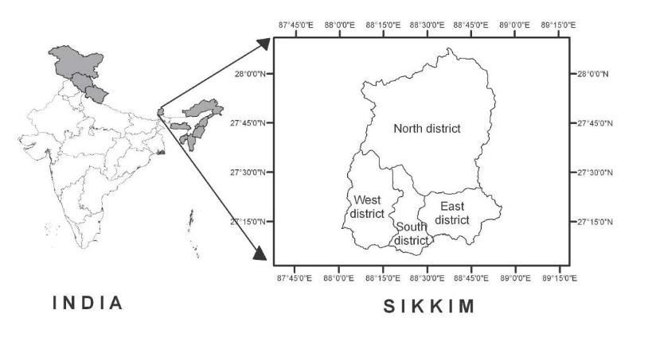
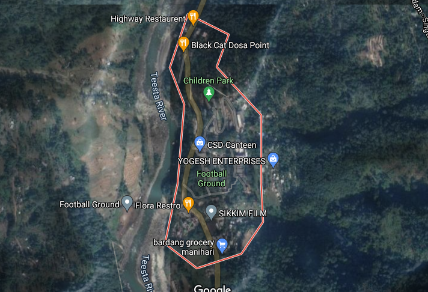
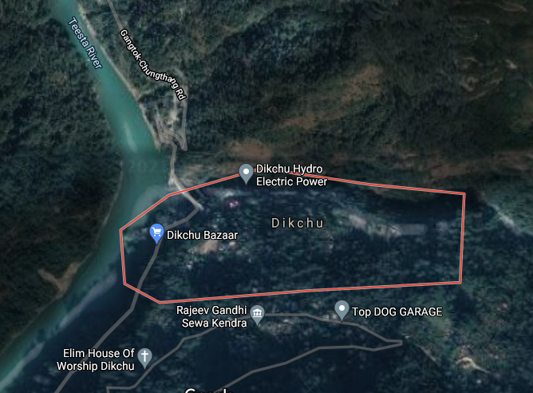
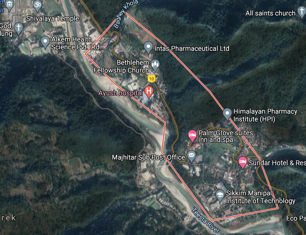
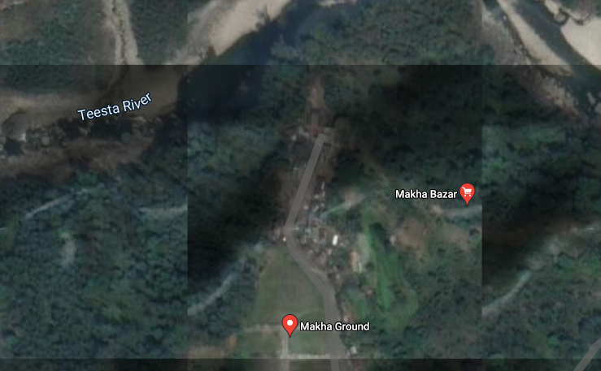
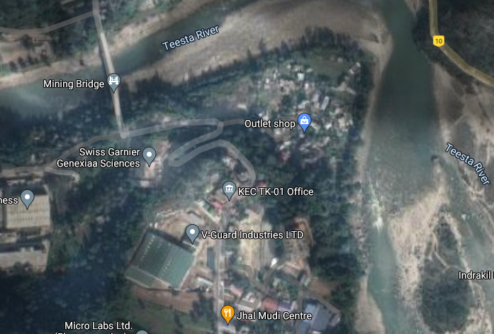
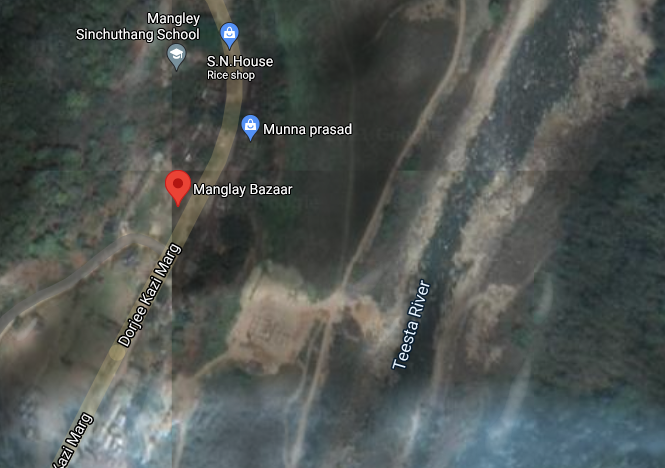
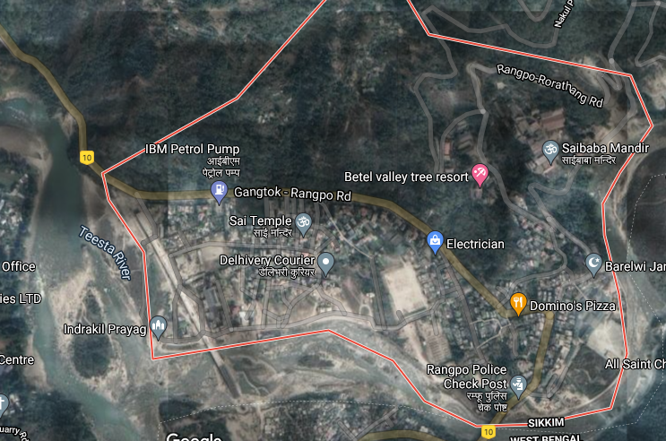
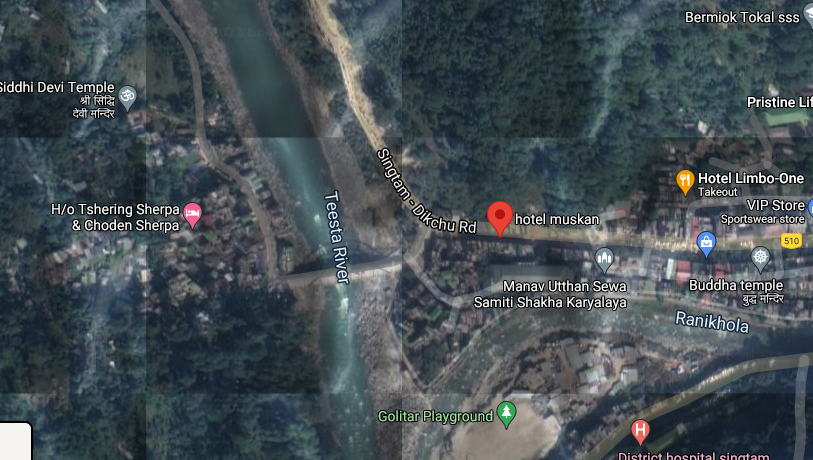
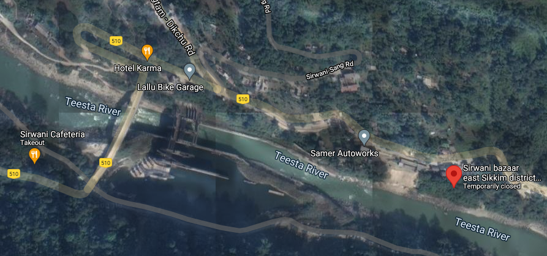

```{r setup, include=FALSE}
knitr::opts_chunk$set(echo = FALSE, warning = FALSE, message = FALSE)
```

```{r, echo=FALSE, warning=FALSE, message=FALSE}
library(tidyverse)
library(readxl)
library(DCchoice)
library(gtsummary)
library(ggplot2)
library(wordcloud)
```

## Abstract
This study 

## Introduction
The rivers of the earth not only play an important role in shaping the physical landscape of the planet but also have an impact on the well-being of billions of people living around the world. Rivers provide ecosystem goods like fish, drinking water, wildlife, etc., and services such as boating, and swimming. Free flowing rivers add to the aesthetic values and recreation leading to the increase in property values for those living near them [@Lewis2008]. In addition, free flowing rivers also help dilute waste water discharges helping maintain water quality. Rivers also provide habitat for endangered and threatened species [@Richardson2009].

However, the ability of the rivers in providing such ecosystem goods and services are reduced when anthropogenic activities are performed beyond a sustainable threshold level. For instance, river-daming creates a threat to many native species of fish due to the reduction in the fish passage. Extensive anthropogenic interventions have resulted in loss of biodiversity in recent decades in India. In particular, development works such as construction of roads, dams, and urban spaces have been carried out in the Himalayan region of India which has created a negative impact on the Himalayan biodiversity[@Gaur1999; @Kanwal2010].

Sikkim is a small Himalayan state in India which lies between 27^0 00' 46" to 28^0 07' 48" N latitude and 88^0 00' 58" to 88^0 55' 25"E longitude and covers a geographical area of 7,096 sq km. The river Teesta is a major river in the Himalayan region which originates from the glaciers of Sikkim in the north at an elevation of 8,250 m. The river originates as Chhombo Chhu in the extreme north and flows east and south joining many tributaries like the Zemu Chhu, Lachung Chhu, Rangyong Chhu, Dik Chu, Rani Khola, Rangpo Chhu, and the Rangit river [@Prasai2013]. The entire sate of Sikkim covers the upper basin of the river Teesta. The Teesta river joins the river Rangeet at Teesta Bazar (in West Bengal) then flows through Darjeeling district in West Bengal before joining the river Brahmaputra in Bangladesh. The name 'Teesta' originates from the Sanskrit word 'Triosta' refering to the three main channels of the historic Teesta river basin, namely Karatoa, Purnabhaba, and Atrai [@Prasai2013].  The river Teesta flows with high velocity bringing down large sediments, and the velocity of the river is about 6 meters per second with an average suspended sediment load of about $15.89 \times 10^6$ ton per year [@Goyal2018]. 

The Sikkim Himalaya with rugged topography, ongoing seismic activity and heavy rainfall is subjected to intense landslide activities. The spurt of developmental activity in the region has lead to substantial growth in the area affected by landslide activity. The number of new landslides outranks that of old landslides in most of the watersheds in Teesta basin. Teesta (Lower Part) watershed contains maximum  number of new landslides. There are also large numbers of old landslide scars present in this watershed. In Prek Chhu, 100 new landslides scars have been recorded. It is to be noted here that the rate of developmental activity in Teesta (Lower Part), Rangit river and Rangpo Chhu watersheds is very high. In Rani Khola, watershed the number of new landslide scars are also higher compared to old landslide scars. Gangtok, the capital city of Sikkim lies in this watershed. Over the years this city has grown on the hill slope towards its fringe. However, a large number of active landslides in the region along Lachung and Lachen axes provide evidence to the high degree of seismic and geological fragility of this zone. Glacial moraines, mostly confined to North Sikkim, along with numerous active landslides in the region, indicate that this locale represents a fragile ecosystem [@CISMHE2006].

Teesta river basin accounts for a rich floral diversity. 4000 species of flowering plants inhabits the basin. Presently, 3418 species of angiosperms and gymnosperms could be recorded from Teesta basin in Sikkim. But over time, more than 50 species of plants are vulnerable as defined by IUCN. Zeuxine pulchra (Orchidaceae) and Dennstaedlia elwesu (Dennstaedtcaceae)  have disappeared, 10  species are vulnerable and 18 are rare. Endemic plants such as Zeuxine pulchra are extinct, only 6 out of 9 could be found. While 34 species of Rhododendrons and 445 species belonging to 117 genre of orchids could be found. 40-60% of flowering plants are used for various purposes ranging from food, medicines to furniture, instruments for games and arms and various other miscellaneous purposes. More than 400 species of plants are used to cure various ailments. 639 species are used as timber, fuel wood and other uses. 8/10 species of plants are uses as cereals, spices and condiments. East Sikkim constitutes the maximum of about 70% of the total floral diversity while North Sikkim has 30% forest cover but it is on top with respect to the number of flowering plants or endemic species. Teesta basin provides home for 169 species of mammals and 689 species of butterflies. Several species of reptiles (e.g. pit vipers, skinks, and Himalayan agamids) are restricted to the middle altitude of the Sikkim and Eastern Himalaya. The snow toad (Scutiger sikkimensis) is an endemic amphibian of the region, along with several species belonging to the genus Paa. Both higher and lower altitudes had higher number of restricted species of butterflies. According to IUCN Red Panda is endangered in the list of animals while the marbles cat is found only in Chungthang area only in Teesta river basin. Looking at the number of species of studied if the development project is executed near Chungthang an irreversible ecological damage is expected with respect to its biological environment [@CISMHE2006]. One of the major threats especially to both large and small mammals, larger birds and amphibians is hunting which needs to be checked.

The nutrient concentrations in Teesta river were recorded to be significantly low in upper stretch whereas there were noticeable temporal and spatial variations in nutrient concentrations in lower stretch. The present investigation indicates that water of Teesta river basin is generally healthy in its physico-chemical and biological water quality. However, the overall water quality in the lower stretches of streams like Rani Khola and Rangpo Chhu (at Rangpo) is relatively poor due to anthropogenic activities in their catchment i.e. imainly due to the location of townships like Gangtok, Pakyong, etc. in its upstream catchment. There may be a limitation of the resource during the lean season.  Also, a number of large glaciers in the vicinity would further limit the required water availability during long winters.

India has an estimated total hydroelectric power potential of 84 GW. Of this, Sikkim’s potential share is 2.9%, or about 4.29 GW. The Central Electricity Authority of India prepared a preliminary feasibility report in 2004 on the establishment of 162 new hydroelectric schemes with a total potential of over 50,000 MW. In this scheme Sikkim has ten projects with an installed capacity of 1,469 MW [@CEA2015]. The total hydroelectricity potential in Sikkim stands at 5,325 MW spread across different stages of implementation [@EDPS2020]. Currently 15 projects are under different stages of construction and according to the Draft National Electricity Plan 2018, all the projects shall be completed by 2022.

The presence of multiple dams on the river Teesta and its tributaries could accelerate earthquakes and increase the damages. Earthquakes were seen to hit the region of Dzongu and Chungthang. It was reported that 16 died while working on Teesta III hydro power project when earthquake hit Sikkim on 18th September, 2011. Also, on 13th August, 2016 massive landslide blocked the flow of Kanaka river near Mantam in Dzongu region in North Sikkim. Construction of hydropower projects may often lead to shortages of drinking water. There has been a disappearance of springs/streams leading to decrease in water shortages. Also dams have blocked the natural river water and reduced downstream river levels. Use of dynamites in road construction and in underground tunneling by hydropower projects are the primary causes that develop cracks in acquifers resulting into water loss. Also, evidences of health damages were seen where 6 person were affected from Dengue and were being treated at Rangpo primary Health Centre. Apart from this no employment opportunities were offered to the local people.

Traffic congestion, accidents and deaths are other issues faced by the local people living near the project sites. While cultural intrusion also forms a major issue levied by the local people upon migration. Significant protests were seen in the past by the Lepcha communities upon construction of such development projects. There also seems a changes in the agricultural productivity in the project sites. Production of pulses seemed to have been declining over time. Also, the size of fruit like Mandarin orange and guava have grown smaller thereby losing its vigour, colour and taste alongside market competition. 

Thus, there is an intense need to evaluate the restoration benefits of the Teesta Riverine Ecosystem for long term sustainability and wide range of flora and fauna protection. Such benefits could be accrued not only to wildlife but also could be utilized for achieving long term inclusive growth.

## Literature review
### Contingent Valuation and Willingness to Pay
We are familiar with the idea that any economic value is a measure of the benefit provided by a good or service to an economic agent and so is the concept of the economic valuation of any ecosystem where its value is determined by the services it provides to its users be it human beings or the wide flora and fauna. Total economic value of an ecosystem can be categorised into two categories one is the its use value (e.g. ecosystem provided provisions such as fuel wood, non-timber forest products, water cycle, recreation, tourism, etc.) while the other is its non-use value (option value which involves its future use value, bequest value and vicarious value and  existence value). When the value of an ecosystem is deflected directly or indirectly through some market transactions and the valuation is carried out using such market transactions then we can say that the stakeholders’ value is revealed in a market, such a valuation method is generally called revealed preference method or approach. Some examples are hedonic price method, travel cost method, productivity method etc. Sometimes the value of some environmental resource or amenity does not have any direct or indirect link with market. In such cases, there is no possible way to assign a monetary value to the resource or amenity using market transactions  in such cases the only possible way to assign the value is to identify the stakeholders’ and elicit responses from regarding their preference for the amenity or resource through a monetary measure. In such cases, the stakeholders’ state their preferences to the interviewer instead of actually carrying out any market transaction. Such a method is called stated preference approach. There are some variations of this method such as Willingness to Pay (WTP) survey, bidding game, dichotomous choice experiment, conjoint analysis, etc. As a whole, these methods are generally called Contingent Valuation Method (CVM). CVM is generally carried out for estimating non-use values. In most of the literature it was found that this CVM method were used in order to determine the WTP to restore the ecosystem and to avoid any further deterioration. 


Specifically we are concerned with the river ecosystem here and understanding public support for ecosystem restoration is critical to its successful implementation because the sustainability of sound resource management is rooted in stakeholders’ support [@Alam2015]. Khorshed Alam in his paper “Factors affecting public participation in river ecosystem restoration using the CVM” tried to generate information for better understanding  of the planning and implementation of ecosystem restoration strategies. For this purpose, the data was collected from the adult population of Dhaka City, located in the dying Buriganga River catchment. CVM method was use to measure participants’ WTP, both in the form of money and time. Total WTP included both the WTP in the form of money and time. These WTPs constituted the dependent variables which were determined using other socio-demographic variables like household income, individual’s occupation status within family , age, level of education, sex and dependency on the river resources (independent variables). The effects were analysed by modelling the discrete response to the WTC questions using a logistic transformation. It was found that there existed a significant relationship between participants willingness to participate in the ecosystem restoration and their socio-demographic characteristics while engagement with meaningful work did have a significant effect on determining participants' WTC. The factors identified were significant issues explaining preferences but other factors may  have played a greater role in shaping participants attitudes and there was still a great deal not known about why people were willing to support or oppose specific ecosystem restoration. Nevertheless, this paper suggested that the public participation with one's physical presence in the restoration initiatives would increase the possibility of longer lasting protection of the restored resources. There was a need to develop public awareness programs regarding conservation and restoration of critical environmental resources through electronic and print media and while education programs should include lessons on environmental protection and restoration issues. While participation, learning and enhanced awareness could provide additional benefits for long term restoration efforts. This paper presented a much more relevant scenario of the developing countries.

Some examples of the use of CVM and dichotomous choice experiment to capture the economic value of restoring the ecosystem could be cited in its application in two of the regions of China: Ejina and Hei River Valley and Zhujiajiao water town located in south western Shanghai, China. In the Ejina region, CVM was used. A multiple bounded likelihood model were used resulting in a log likelihood function and the median of WTP was calculated. An LLR tests were conducted in order to determine whether the valuation behaviour across the two geographic regions (Surrounding and Main) were similar or not. It was found that there was a substantial non-market WTP for restoring Ejina ecosystem services and the aggregate present value of the benefit of restoring Ejina ecosystem service was 55.33 million (RMB). The valuation information could be used by the government bureau of Hei valley in its evaluation of the restoration actions which implied the scope for further research in this area in China [@Zhongmin2003]. While in the Zhujiajiao water town a choice experiment with a multinomial logit model and a random parameter logit model was used to assess respondents’ cognitive preferences regarding attributes of river networks, and their possible sources of heterogeneity. "Choice attributes taken were stream morphology, water quality, riverfront condition and cost. Stream morphology, water quality, riverfront condition, WTP for improvements by each household per month, Alternative Specific Constant (ASC was created to capture the mean effect of unobserved factors in the error terms), respondent's identification number, choice set number, gender, age of respondent in year, local household or not, number of household members, household members engaged in water protection career, household with children under 18, monthly household income were taken as an independent variables. A choice experiment with a multinomial logit model and a random parameter logit model was used to assess respondents’ cognitive preferences regarding attributes of river networks, and their possible sources of heterogeneity. The analysis showed that the riverfront condition was the attribute most preferred by respondents, while stream morphology was the least preferred. The current status of each of three river network attributes was not desirable, and respondents would prefer a river network with a ‘‘branch pattern,’’ that is ‘‘limpid with no odor,’’ and ‘‘accessible with vegetation. Also the estimated willingness to pay was mainly affected by household monthly income (positive for high income), residential location (positive for people not living in survey region), and whether respondents had household members engaged in a water protection career (positive for household member not engaged in water protection career). The high proportion of respondents that reported a positive WTP, and the substantial estimated WTP for improvements from the current baseline condition, indicated that raising funds from the public for river network improvement is feasible, which could be used to guide policy-making on improvements and raising public awareness [@Che2014]. It is to be noted that this paper provided policy makers with information on benefits that may accrue to stakeholders as a result of river status improvement. 

The application of CVM and choice method were conducted in USA as well. Deckers Creek Watershed in Monongalia and Preston counties of West Virginia were taken for the purpose of examining the economic valuation of stream restoration. Three restoration attributes were taken: acquatic life, swimming and scenic quality. Alternative Specific Constant (ASC) variable was created. Socio-demographic and attitudinal variables included gender, adult population age, education and average household income. While the welfare variables included age, education, gender and income including two other attributes: knowledge and attitudes and stream restoration attributes. With the choice and survey data acquired in the research, nested logit models were estimated and log likelihood tests were used to compare two subsamples of the survey population: the general population and stream users represented by stream restoration activists and rail-trail respondents. It was found that the respondents had stronger preferences for full restoration of the acquatic life than the other two attributes and the benefits from restoration of Deckers Creek was estimated to be about $1.9 million annually with only an estimated one third of households placing a positive value on restoration [@Collins2005]. This restoration choice survey using only users and activists may be representative of the other watershed population as well and not only Deckers Creek. 

Middle Rio Grande Bosque in Albuquerque, New Mexico (Bosque) region were also undertaken for study with a view to capture public values for river restoration options. CE and CV question attributes were fish and wildlife, vegetation density, tree type, natural river processes and cost of bond to household. Indirect utility of alternative "i" for person "n" was the dependent variable. While ASC, cost, wildlife population, thinning of the Bosque: moderate and full, equal proportions of native and non-native trees, dominance of native and non-native trees, river control (higher spring flows, 10% removal of bank stabilization, 10% lowering of floodplains and status quo management), minimum distance between the respondent's household and the closest Bosque access, households visit to the Bosque, awareness of the present state of Bosque, whether born in New Mexico or not and income constituted the independent variable. Both choice experiment (CE) and contingent valuation (CV) analyses were used to obtain survey responses for quantifying public benefits of conservation policies. The CV results (cross check on CE) were found using maximum likelihood estimation, here the income categories were converted to a continuous scale and used as the predicting variable for bid amount. The result showed a quantification of human preference for native tree species such as Cottonwood over non-native tree species such as Saltcedar. Thinning was the second most highly valued component of restoration, with values between $\$35$ and $\$40$ per house- hold per year. The natural river processes attribute elicited a mean value of about $15 per household per year indicating philosophic support for a freer flowing river or appreciation of process-oriented restoration among Albuquerque citizenry. The welfare estimates for fish and wildlife and natural river processes both represented  significant per household per year benefit. While for the Middle Rio Grand Bosque, re establishing native tree dominance was the most important restoration feature. Forest thinning was second in important, followed by improving natural river processes and improving fish and wildlife populations [@Weber2009]. Established techniques exist to quantify human benefits from environmental restoration. Public fund expenditures for restoration efforts may be more efficient if public preferences are explicitly taken into account. Surveys are only a primary means of gauging public preferences, though nonresponse bias can be important because surveys typically represent only a fraction of the population. Given quantified benefits and costs for various restoration options, benefit–cost analysis can be one criteria for guiding successful restoration projects.

Another study was conducted in the two river systems in the southwestern USA: the San Pedro Riparian National Conservancy Area (SPRNCA) in southeastern Arizona and the  Middle Rio Grande (MRG) in central New Mexico. The main attributes for the study site were water availability, vegetation composition and the linking of vegetation with water availability and bird abundances presented as both breeding birds by nest height and by surface water dependency and migratory birds. Demographic variables included gender, age, education and mean household income. Other attributes like whether the individual had visited MRG or not, plan to visit MRG or not and whether the individuals watched bird as a recreational activity or not were also taken into account. CV survey were undertaken to estimate individual WTP and a maximum likelihood model for the single- bounded mean WTP were estimated. Here the estimates for preservation and restoration were found to be statistically significant and positive for the SPRNCA with only the restoration scenario being significant for the MRG. The WTP results for SPRNCA could be interpreted as a non-use value as the majority of respondents had not previously visited the site. The WTP estimates for restoration efforts in MRG could be interpreted as a use value as the majority of the respondents had previously visited this section of the Rio Grande [@Broadbent2015]. Valuation exercises should not only focus on the benefits that are derived from restoring ecosystems but also focus on preserving ecosystems. The results of this study should be interpreted with some caution if they are to be implemented in a policy context as they may not be representative of the population WTP for preservation and restoration alternatives in these ecosystems.

Focusing on the Glen Canyon Dam (GCD), a critical source of hydropower and peaking capacity on the Colorado River, US, a non-market values, expected to be significantly composed of non-use values, using the contingent valuation (CV) method  an inclusive approach was devised for the study of multiple social, cultural, and environmental effects of both downstream riverine effects and hydropower production and distribution in the broader basin. WTP response was captured  using  age, gender, household income, political ideology, knowledge of Glen Canyon Dam (GCD) and  government responses. WTP was estimated from stated preference CV response data using a standard discrete choice logit model and a median WTP was calculated from the log-likelihood function. It was found that the members of the US public who believed that hydropower is an important resource to consider when setting GCD policy were significantly less likely to support change and more likely to hold a positive non-market value for continuation of existing operations. On the other hand, household net WTP for continuation were estimated at $\$21.51$ or $\$2.9$ billion nation- wide per year for 20 years, providing significant economic evidence in favor of maintaining current GCD operations [@Jones2018]. Thus the non-market valuation studies of hydroelectric dam management must consider carefully an inclusive range of externality effects.

A choice experiment method was used to capture the non-market benefits of river restoration in the Danube river flowing through Austria, Hungary and Romania. Choice attributes such as flood return period, water quality and price were used. ASC was created. and WTP were calculated using these choice attributes, preference heterogenity, interactions with distance, interactions with perception and interactions with users. Discrete Choice Experiments (DCE) were used and the responses choices were analysed using random parameters logit (RPL) models. The models were estimated using a Halton sequence of 1000 replications in a quasi-Monte Carlo maximum likelihood simulation and the mean WTP was calculated. The welfare impacts were measured through a stated choice experiment, carried out in three different countries, using a common experimental design to enable direct comparison of the non-market benefits of WFD implementation. The estimated choice models in the three countries were found to be significantly different, indicating that their potential for transferability is limited, and the collected choice data could therefore not be merged and estimated using one pooled model. Observed and unobserved preference heterogeneity played a significant role in the three countries, and this was an important reason for the non- transferability of the results. The effect of river restoration on flood frequency  were found to only influence choices in the Austrian sample and not in Hungary and Romania. While significant distance-decay effects were found for the water quality improvements in Austria and Romania. In Hungary only a significant effect was found for respondents who visited the study area before and those who had not. The welfare impacts of river restoration in the context of the WFD were positive, but differed significantly throughout the Danube river basin, i.e. within and between the countries through which the river flows, given the significant role of distance-decay [@Brouwer2016]. The estimated non-market benefits of river restoration presented in this paper provided an important international benchmark for the assessment of the proportionality of the costs associated with river restoration.

### The Benefit Transfer Method
The Contingent Valuation method (CVM) is a major source of economic values for benefit transfer based policy analysis [@Johnson2015]. According to @Carson2011, the CVM has been mostly used after 2007 and hence the most cited method in the valuation literature. However, considering the amount of time and resources required in CVM surveys, the benefit transfer approach was developed so that the findings from one site (the study site) can be applied to another site (policy site). Benefit transfer has been used in different policy contexts since 1950s. Two influential CVM-benefit transfer studies done by @Luken1992 and @Desvousges1992 motivated for a development of the benefit transfer as a distinct field of research. Both the studies employed unit value transfer which is applying the WTP estimate obtained in the study site directly to the policy site. However, @Loomis1992 introduced the benefit function transfer in which an empirical model developed in a study site can be used to estimate the benefits at the policy site. Generally, the results from a benefit function transfer are better than the ones from the unit value transfer [@Johnston2010]. @Boyle1992 was the fist to propose the convergent validity test i.e. the percentage transfer error whiich is very commonly used in contemporary research.

@Downing1996 use the CVM- benefit transfer method to estimate the benefits of marine recreational fishing in Texas bay and find few coefficients which were equal. Also in another study by @Kirchhoff1997, they find that the transfer of the benefit estimates obtained from Arizona and New Mexico studies resulted in rejection of convergent validity test in 55 to 90% of the benefit function transfer. @Kaul2013 remark that benefit function transfer outperform the unit value transfer and the CVM performs equally to other methods. 

@Mathieus2010 used a simple benefit transfer approach to estimate nutrient-water quality estimates based on Montana's population and land area. Estimates of beach recreation in Florida was transferred to Southern California after adjusting for inflation. Point estimates were used in this study. In the same study, estimates for sport fishing, boating, and surfing were also estimated and transferred.  @Carson2004 conducted a CVM-WTP study to estimate WTP to avoid oil spills on sandy beaches, rocky shorelines, and saltwater marshes in California. The estimates used used or transferred to estimate the damages from future oil spills along the California coast.

Over the last three decades, the use and challenges of benefit transfer have grown along with the concerns of validity and accuracy [@Johnston2010]. Newer developments in the fields of understanding, application, and limitations have come up while the objective of the benefit transfer have remained the same. The benefit transfer is used not only for WTP estimates but also for other welfare estimates, and newer methods and understanding of the factors that influence the transfer accuracy have evolved.  


### River restoration
The rivers' long-term viability as social-ecological systems is jeopardised, and immediate intervention is required. River restoration was identified as necessary to re-establish river functions[@SER2004]. According to @Allison2007, "restoration is an activity for which picking the proper terminology to characterise that approach has proven particularly difficult." There are many different definitions of river restoration, and their substance often overlaps. River restoration, according to @Palmer2006, is the activity of "repairing streams that can no longer perform critical ecological and social tasks," and it is the only definition that clearly prioritises both social and ecological aspects of rivers. Faced with a wide range of projects, the Society of Ecological Restoration (SER) decided that all restoration efforts, such as ecological restoration, rehabilitation, reclamation, and mitigation, should be lumped together under the term restoration but varied in terms of ecological quality goals [@SER2004]. 

Ecological restorations, according to SER criteria, attempt to restore a historical condition in terms of form, species composition, and community organisation. Rehabilitations aim to restore ecosystem processes, products, and services while also restoring a historical ecological status. Reclamations are land rehabilitations that include terrain stabilisation and revegetation in the setting of mined areas. Mitigations aim for a pre-disturbance state rather than historical status and pay for environmental harms. The use of a single name for such a diverse variety of restoration efforts caused confusion and may imperil comparison and cross-fertilization. For example, the targeted ecological quality of US initiatives reported by @Bernhardt2005 and French ones reported by @Morandi2014 differed.

Restoration sciences are experimental fields that learn from their successes and failures [@Palmer2006]. River restorations have been inventoried extensively to improve experience transmission [@Bernhardt2005; @Feld2011; @Kail2016; @Muhar2016; @Speed2016]. As part of national and international research projects, several surveys were conducted. One of the earliest was the National River Restoration Science Synthesis (NRRSS), which compiled information on projects in the United States [@Bernhardt2005]. Two databases were created at the same time in Europe. 

According to the Oxford dictionary, a *driver* is a force that causes a phenomena to occur or develop. Five types of restoration drivers have been identified [@Clewell2006]. Legislation and institutional mandates are *technocratic* drivers; *biotic* drivers, such as local biodiversity, are biotic drivers. Experimental projects that elicit or demonstrate ecological principles and biotic expressions are *heuristic* drives. *Idealistic* factors include personal and cultural concerns about environmental deterioration, as well as *pragmatic* drivers such as maximising natural resource supply.The loss of ecosystem services, such as provisioning, regulation, and cultural functions, has been identified as a primary motivation of river restoration efforts [@Galatowitsch2012].

However, indirect factors have been suggested as significant for the emergence of the restoration tendency, such as idealistic or moral shifts, and environmental policies [@Clewell2006]. In many countries, water policies shifted dramatically in the twentieth century, focusing on natural resource development and conservation rather than ensuring water usability for economic and domestic purposes and maintaining navigability [@Holmes1972;  @Getches2001; @Gerlak2011; @Goldin2010; @Victor2015]. Although water regulations vary by country, a global trend may be seen.
First, water policies aimed at regulating water sharing between users and improving water quality for easier human use and higher recreation potential [@Gerlak2011; @Victor2015], such as the Clean Water Act and Safe Drinking Water Act in the United States, and the National Drought Policy in Canada [@Gerlak2011; @Victor2018]. Then, starting in the 1970s, policies began to shift dramatically in response to new environmental concerns, the need for climate change adaptation, and an increase in demand for natural-based solutions, such as flood control via environmental mitigation, restoration, and storm water retention areas [@Heathcote2005; @Kiem2013]. 

The Water Framework Directive (WFD) (EU 2000) is the world's most comprehensive environmental law. It mandates that all water bodies inside the European Union meet certain ecological, hydromorphological, and chemical standards. It distinguishes between natural water bodies that must maintain their excellent ecological condition and extensively modified and artificial water bodies that must maintain their good ecological quality. If the quality goals are not met, the WFD requests that they be restored. As a result,  @Kaika2003, @Hering2010, and @Smith2014 have identified it as a key driver of European river restoration efforts. The WFD adopted the idea of reference conditions, which means that the water body's condition is assessed by comparing its current state to an undisturbed state. Many scientists, however, believe that this status undervalues natural environmental development (e.g., water course changes and natural incision) and does not take into account the entire socioecological system [@Moss2008;  @Josefsson2011].

For giving feedback and direction, project assessment is a key concern. However, just a few projects use a monitoring system. Only around 10% of projects in the United States and Bavaria (Germany) have been tracked [@Bernhardt2005; @Pander2013]. In France, @Morandi2014 conducted a research on the applied evaluation method. Only half of the projects they looked at employed a before-and-after comparison, and most of them only had one year of pre-restoration monitoring. Long-term monitoring, defined as monitoring that occurs longer than 10 years after installation, was used in less than 15% of the cases studied. They discovered that after a restoration project in France, more than 84 percent of the monitoring procedures measured fish diversity and richness, 80 percent monitored macroinvertebrates, 57 percent surveyed stream and floodplain vegetation, and 30 percent monitored other fauna, such as reptiles and birds. Rather than focusing on specific targets, these studies focused on the biological response by monitoring the entire community's characteristics.

### Anti-dam movements in Sikkim
Since the first protests in 1995, the hydel issue has taken centre stage in Sikkim's sociopolitical, religious, and economic discourse. Since its inception, many organisations have banded together under various banners with the primary goal of opposing the development of hydropower projects in Sikkim. Representatives from all Sikkim's monasteries marched through Gangtok on July 29, 1995, pounding drums and cymbals and carrying banners. They demanded that development on the Rathong Chu hydropower project be halted and the entire exercise be abandoned immediately. They chose to demonstrate in the streets because the Association of Buddhist Monks of Sikkim's memorandum, filed on July 24, 1994, before work began on the dam site, was disregarded. Three tribal organisations (the Bhutia Lepcha Association, the Tribal Women s Association, and the Association of Buddhist Monks of Sikkim) petitioned the Sikkim High Court in August 1994, seeking that the Rathong Chu hydropower project be closed. Unfortunately, the court case went nowhere, and with hearings postponed and building work continuing, the Concerned Citizens of Sikkim (CCS) was founded in May 1995 to oppose the project. This group of Bhutia activists organised a peaceful protest and an education campaign in order to get the project cancelled. Sensing the need for severe measures, the CCS conducted a hunger strike in Gangtok, demanding that work at the project site be suspended while an independent team of experts reviewed the entire project.

Sonam Paljor Denjongpa, a Sikkimese merchant who had returned from the United States as a lama, was a CCS member who fasted for 28 days in a row. Finally, on July 5, Chief Minister Pawan Kumar Chamling and Power Minister Yeshe Lachungpa assured Denjongpa that work would be halted and that "the State Government would constitute a high level committee which will thoroughly examine all aspects of the project, taking into consideration the project's effect on the environment, religion, social and historical sites of the region" [@Schaefer1995]. Unfortunately, activity was not halted but rather escalated, and the committee was not appointed by the state administration. This led Concerned Citizens to step up their efforts. Meanwhile, the hunger strike helped the CCS gain public support among the Bhutia and Lepcha communities in Sikkim. The government eventually appointed a one-man commission to examine the problem, chaired by environmentalist Prof. Ramakrishna, because of the determination and persistence with which CCS opposed. Prof. Ramakrishna's suggestions resulted in the project's cancellation in 1997.

In 2003, a small group of Lepcha activists arrived in the Dzongu villages to protest the hydro projects. They travelled from town to hamlet, gathering support and holding small meetings at each one. Their main goal was to oppose the massive Teesta River hydropower projects planned for Dzongu and to raise awareness among the Lepcha people about the projects' negative consequences. When they established Affected Citizens of Teesta in July 2004, they formalised these gatherings (ACT). Much of the Lepcha resistance was restricted to Dzongu villages during the first three years. It was a moment for developing, communicating, and finding others who shared a vision for Dzongu that did not include major infrastructure development [@Little2010]. However, Dzongu's position as a reserve had the consequence of not only isolating Dzongu from the rest of the world, but also of confining activists' voices to Dzongu's villages. As a result, in June 2007, the movement was transferred to Gangtok, the capital of Sikkim. Bhutia Lepcha (BL) House, a dilapidated structure on Tibet Road in Gangtok, became the location of their main protest. “The most important benefit we received from moving our march to Gangtok was ‘media attention.' All of our actions were covered in Sikkim's publications. This assisted us in disseminating information about the protest not just within Sikkim but even beyond its borders.”

Following its transfer, the campaign moved to the Lepcha enclave in neighbouring West Bengal and the city of New Delhi, where activists shared their protest storey with the larger Lepcha community, NGOs, and the Indian Central government [@Little2010]. Following the failure of several rounds of negotiations and meetings with the chief minister, chief secretary, and electricity department, ACT activists began a series of relay hunger strikes in June 2007. Dawa Lepcha and Tenzing Lepcha of the Affected Citizens of Teesta sat in front of BL House and began an indefinite hunger strike that captivated Sikkim for 63 days. The duo ended their fast when the government promised to evaluate these projects by creating an impartial review committee, a promise that the current democratically elected government of Sikkim did not follow [@Arora2008]. As a result, on March 10, 2008, Dawa Lepcha and Tenzing Lepcha began a second round of indefinite fasting. This time, the hunger strike in Gangtok, Sikkim, lasted 96 days. These two young activists broke their fast after receiving formal promise from the Sikkim government that the four hydropower projects in the Dzongu region of north Sikkim will be halted. Pema Wangchen, the chief engineer-cum-secretary of the Sikkim state power department, issued an official statement on June 12, 2008, announcing the cancellation of the 90 Mw Ringpi, 33 Mw Rukel, 120 Mw Lingza, and 141 Mw Rangyong projects. “Affected Citizens of Teesta is still a functioning organisation. Though we praised and welcomed the government's decision to shut four of the seven proposed dams in Dzongu, we will continue to oppose the remaining projects in Dzongu and other projects in Sikkim,” said Dawa Lepcha.

Three projects were suggested in the river Rathong Chu at the same time in 2003, the same river where the Rathong Chu project was considered and ultimately cancelled. As a result, the new plan in the same location aroused instant opposition to the projects. Initially, the protest campaign was led by the Sikkim Bhutia Lepcha Apex Committee, a cultural organisation (SIBLAC). However, the campaign gained momentum once Tseten Tashi Bhutia, a formal Member of the Sikkim Legislative Assembly, took over the leadership of the SIBLAC. Following his takeover, several more Sikkim NGO's joined the campaign. Later in February 2012, the Sikkim Government issued a statement cancelling two of the three proposed projects over the River Rathong Chu in West Sikkim (96 MW Lethang and 99 MW Ting Ting). The cancellations occurred almost a month after a high-powered committee created to suggest project cancellations delivered its findings. They are now vying for the third, the Tashiding HEP. “Closure of these two projects is useless until the Tashiding Hydel Project is scrapped.”

There are societal concerns that campaigners believe the government is unconcerned about. A single project employs at least 2000 people. These influxes have created disequilibrium in the region's demographic character, particularly in Northern Sikkim, which is sparsely inhabited. There have been reports of a significant increase in Sexually Transmitted Diseases (STDs) in the areas where the power plants are being built. Workers are required to undertake a proper medical screening exam before visiting the project site, according to the criteria established by the State government prior to signing the Memorandum of Understanding.

However, such standards are frequently ignored, and the government has no system in place to oversee them. Crime against women and molestation charges have increased. Despite the fact that there is no agreement on the link between these annoyances and the arrival of hydroelectric projects, the government has never agreed to do a thorough investigation and study on the topic. The people of Sikkim lack the necessary skills to work in either the lower or higher-level professions offered by these hydropower plants. The majority of the individuals working in such projects from Sikkim are children and teenagers who are employed in third-grade labour jobs such as lugging stones and so on. Apart from the Lepcha Community, the territory, as a limited settlement area, is now vulnerable to certain major economic and social changes that have long been resisted by residents and the state government in order to preserve the community's history and culture. This can be seen in certain instances when foreigners have purposefully altered the names of various locations, such as Kewzing to Rangit Nagar, Guru Dongmar Lake to Guru Nanak Lake, and so on, therefore affecting the historical and cultural value of the region.

Sikkim, located in north-east India, is also one of the world's six most seismically active areas, along with Mexico, Taiwan, California, Japan, and Turkey. It is assigned to Zone 5. During the previous century, the region has been subjected to 19 major earthquakes, including the big earthquakes of Shillong (1897), the Assam-Tibet border (1950), and Sikkim (2011). The administration of Sikkim takes the region's seismicity for granted. The project component is constructed in such a way that even a large earthquake would not destroy it, but the collateral damage produced during construction by major blasting and tunnelling operations is being undermined. According to A.C.T, SIBLAC, and other groups, the construction business N.H.P.C has been flagrantly breaching several Environmental and Forest regulations outlined in the MoU (Memorandum of Understanding) for these projects. Until date, the D.F.O. and D.F.E.W. have filed four contempt petitions against the N.H.P.C., for which the MoEF (Ministry of Environment and Forests) has confirmed the infractions and issued a show-cause notice. Illegal and indiscriminate muck dumping has been observed in Lower Samdong's river banks and water reserves, plainly violating Section 29 of the Sikkim Forests, Water Courses, and Road Reserve Preservation and Protection Act (1988) [@ACT2013]. Similar violations have been reported in other dam construction regions, including Dikchu, Tungtar, Elainchay Khola, and others, while other dam construction sites, including Singbel, Dung Dung, Lower Khamdong, Tungtar, and Lower Samdong, have experienced serious deviations from construction plans, which is an E.P.A. violation [@ACT2013]. The E.I.A (Environmental Impact Assessment) done on Teesta stages III and IV has also been acknowledged as insufficient and unsatisfactory, and even the public hearings have undermined the local people's ideas and grievances.

## Objectives of the study
The study's goals are as follows: 
1. To understand the socioeconomic profile of the people of Sikkim and to analyse livelihood patterns and changes as a result of the development of hydropower projects.
1. To comprehend the effects of hydropower projects in the upper basin of the Teesta River on various issues such as natural ecosystems, culture, livelihoods, and river water quality.
1. To estimate the non-market benefits of river Teesta restoration in the Sikkim Himalaya and to evaluate the transferability of welfare estimates.

## Data and methods
### The study area
The sample were collected from different villages and small towns near the river Teesta, the Teesta Stage V dam, and the Teesta Stage V powerhouse. More specifically, the Teesta Stage V in Sirwani and the Dikchu dam in Dikchu were the prominent destinations. More precisely the places of survey and the sample size are outlined in Table \@ref(tab:villages-sample).

```{r, echo=FALSE, message=FALSE, warning=FALSE}
library(tidyverse)
library(readxl)
library(DCchoice)

booka <- read_excel("book.xlsx",sheet = 'sheet1',   na = "\" \"")
colnames(booka) <- c('name','address', 
                    "age",
                     "gender",
                     "edu",
                     'married',
                     'employ',
                     'income',
                     'community','caste', 'lang',
                     'religion', 'members',
                     'ownership', 'rent',
                     'period',
                     'exp', 'fuel', 'toilet', 'livestock', 'livestock_other',
                     'cultivation', 'area_cultivation', 'HEP_affect1', 'HEP_affect2', 'landslip', 'landslip_increase','species', 'species_affect','species_affect_how', 'religious', 'tourists', 'tourist_start', 'HEP_affect_tourist','HEP_tourists_specify','water_src','water_time', 'water_volume', 'water_spend', 'water_quality', 'water_shortage', 'water_shortage_reason', 'air_quality', 'traffic', 'congested', 'solid_waste', 'solidwaste_specify', 'doctors_available', 'govt_schools', 'electricity_village', 'electricity_house', 'electricity_source', 'name_source',  
                     'migrant', 'migrant_place', 'migrant_why', 'river_services', 'married_HEP', 'same_community_married', 'local_cult_imp', 'cultural_intrusion', 
                     'satisfied', 'rate',
                     'R1','R2', 'reason_not_cont', 'index')

set.seed(1234)
bookb <- data.frame(
  name = sample(booka$name, size = nrow(booka), replace = FALSE),
  address = sample(booka$address, size = nrow(booka), replace = FALSE),
  age = sample(booka$age, size = nrow(booka), replace = FALSE),
  gender = sample(booka$gender, size = nrow(booka), replace = FALSE),
  edu = sample(booka$edu, size = nrow(booka), replace = FALSE),
  married = sample(booka$married, size = nrow(booka), replace = FALSE),
  employ = sample(booka$employ, size = nrow(booka), replace = FALSE),
  income = sample(booka$income, size = nrow(booka), replace = FALSE),
  community = sample(booka$community, size = nrow(booka), replace = FALSE),
  caste = sample(booka$caste, size = nrow(booka), replace = FALSE),
  lang = sample(booka$lang, size = nrow(booka), replace = FALSE),
  religion = sample(booka$religion, size = nrow(booka), replace = FALSE),
  members = sample(booka$members, size = nrow(booka), replace = FALSE),
  ownership = sample(booka$ownership, size = nrow(booka), replace = FALSE),
  rent = sample(booka$rent, size = nrow(booka), replace = FALSE),
  period = sample(booka$period, size = nrow(booka), replace = FALSE),
  exp = sample(booka$exp, size = nrow(booka), replace = FALSE),
  fuel = sample(booka$fuel, size = nrow(booka), replace = FALSE),
  toilet = sample(booka$toilet, size = nrow(booka), replace = FALSE),
  livestock = sample(booka$livestock, size = nrow(booka), replace = FALSE),
  livestock_other = sample(booka$livestock_other, size = nrow(booka), replace = FALSE),
  cultivation = sample(booka$cultivation, size = nrow(booka), replace = FALSE),
  area_cultivation = sample(booka$area_cultivation, size = nrow(booka), replace = FALSE),
  HEP_affect1 = sample(booka$HEP_affect1, size = nrow(booka), replace = FALSE),
  HEP_affect2 = sample(booka$HEP_affect2, size = nrow(booka), replace = FALSE),
  landslip = sample(booka$landslip, size = nrow(booka), replace = FALSE),
  landslip_increase = sample(booka$landslip_increase, size = nrow(booka), replace = FALSE),
  species = sample(booka$species, size = nrow(booka), replace = FALSE),
  species_affect = sample(booka$species_affect, size = nrow(booka), replace = FALSE),
  species_affect_how = sample(booka$species_affect_how, size = nrow(booka), replace = FALSE),
  religious = sample(booka$religious, size = nrow(booka), replace = FALSE),
  tourists = sample(booka$tourists, size = nrow(booka), replace = FALSE),
  tourist_start = sample(booka$tourist_start, size = nrow(booka), replace = FALSE),
  HEP_affect_tourist = sample(booka$HEP_affect_tourist, size = nrow(booka), replace = FALSE),
  HEP_tourists_specify = sample(booka$HEP_tourists_specify, size = nrow(booka), replace = FALSE),
  water_src = sample(booka$water_src, size = nrow(booka), replace = FALSE),
  water_time = sample(booka$water_time, size = nrow(booka), replace = FALSE),
  water_volume = sample(booka$water_volume, size = nrow(booka), replace = FALSE),
  water_spend = sample(booka$water_spend, size = nrow(booka), replace = FALSE),
  water_quality = sample(booka$water_quality, size = nrow(booka), replace = FALSE),
  water_shortage = sample(booka$water_shortage, size = nrow(booka), replace = FALSE),
  water_shortage_reason = sample(booka$water_shortage_reason, size = nrow(booka), replace = FALSE),
  air_quality = sample(booka$air_quality, size = nrow(booka), replace = FALSE),
  traffic = sample(booka$traffic, size = nrow(booka), replace = FALSE),
  congested = sample(booka$congested, size = nrow(booka), replace = FALSE),
  solid_waste = sample(booka$solid_waste, size = nrow(booka), replace = FALSE),
  solidwaste_specify = sample(booka$solidwaste_specify, size = nrow(booka), replace = FALSE),
  doctors_available = sample(booka$doctors_available, size = nrow(booka), replace = FALSE),
  govt_schools = sample(booka$govt_schools, size = nrow(booka), replace = FALSE),
  electricity_village = sample(booka$electricity_village, size = nrow(booka), replace = FALSE),
  electricity_house = sample(booka$electricity_house, size = nrow(booka), replace = FALSE),
  electricity_source = sample(booka$electricity_source, size = nrow(booka), replace = FALSE),
  name_source = sample(booka$name_source, size = nrow(booka), replace = FALSE),
  migrant = sample(booka$migrant, size = nrow(booka), replace = FALSE),
  migrant_place = sample(booka$migrant_place, size = nrow(booka), replace = FALSE),
  migrant_why = sample(booka$migrant_why, size = nrow(booka), replace = FALSE),
  river_services = sample(booka$river_services, size = nrow(booka), replace = FALSE),
  married_HEP = sample(booka$married_HEP, size = nrow(booka), replace = FALSE),
  same_community_married = sample(booka$same_community_married, size = nrow(booka), replace = FALSE),
  local_cult_imp = sample(booka$local_cult_imp, size = nrow(booka), replace = FALSE),
  cultural_intrusion = sample(booka$cultural_intrusion, size = nrow(booka), replace = FALSE),
  satisfied = sample(booka$satisfied, size = nrow(booka), replace = FALSE),
  rate = sample(booka$rate, size = nrow(booka), replace = FALSE),
  R1 = sample(booka$R1, size = nrow(booka), replace = FALSE),
  R2 = sample(booka$R2, size = nrow(booka), replace = FALSE),
  reason_not_cont = sample(booka$reason_not_cont, size = nrow(booka), replace = FALSE),
  index = sample(booka$index, size = nrow(booka), replace = FALSE)
  )

# combining data
book_combined <- rbind(booka, bookb)

# analysis on 830 obs
book_combined1 <- book_combined %>% 
  add_column(BD1 = sample(c(100, 250, 500),size = nrow(book_combined),
                          replace = TRUE), .after= 'R2') %>% 
  mutate(BD2H = if_else(BD1 == 100, 200,
                        if_else(BD1 == 250, 500,
                                if_else(BD1 == 500, 1000,0)))) %>% 
  mutate(BD2L = if_else(BD1 == 100, 50,
                        if_else(BD1 == 250, 125,
                                if_else(BD1 == 500, 250,0)))) %>% 
  mutate(r1 = if_else(R1 == "Yes", 1, 0), 
         r2 = if_else(R2 == "No", 1, 0),
         bd1 = BD1,
         edu = as.factor(edu),
         religion = as.factor(religion)) %>% 
  mutate(bd2 = if_else(r1 == 1, BD2H, BD2L),
         gender = factor(if_else(gender == "Male", 1, 0)),
         income = factor(if_else(income == "Nil to 10,000", 1,
                          if_else(income == "10,001 - 30,000", 2,
                          if_else(income == "30,001 - 50,000", 3,4)))),
         community = as.factor(community),
         employ = as.factor(if_else(employ == 'Farmer', 'Farmer',
                                    if_else(employ == 'Govt. employee', 'Govt. employee',
                                            if_else(employ == 'Casual Worker', 'Casual Worker', 'Other')))),
         edu = as.factor(if_else(edu == 'Other (Specify)', 'Primary',
                   if_else(edu == 'Class 5', 'Secondary',
                           if_else(edu == 'Class 10', 'Secondary',
                                   if_else(edu == 'Class 12', 'Higher Secondary',
                                           if_else(edu == 'Graduate',
                                                   'Graduate',
                                                   'Masters Degree')))))),
         age = as.numeric(age),
         cultivation = as.factor(cultivation),
         religious = as.factor(if_else(religious == 'NA', 'No',
                                    if_else(religious == '-', 'No',"Yes"))),
         exp = as.numeric(exp),
         members = as.numeric(members),
         satisfied = factor(satisfied, levels = c('Satisfied', 'Not satisfied')),
         ownership = as.factor(if_else(ownership == 'Owned', 'Owned',
                                       if_else(ownership == 'Rented', 'Rented', 'Others'))),
         migrant = as.factor(if_else(migrant == 'No', 'No', 'Yes')),
         period = as.numeric(period),
         rating = as.numeric(rate),
         add = case_when(
      substr(address, start = 1, stop = 1) == 'A' ~ 'Singtam',
      substr(address, start = 1, stop = 1) == 'B' ~ 'Bardang',
      substr(address, start = 1, stop = 1) == 'C' ~ 'Majitar',
      substr(address, start = 1, stop = 3) == 'Dik' ~ 'Dikchu',
      substr(address, start = 1, stop = 3) == 'Dar' ~ 'Mamring',
      substr(address, start = 1, stop = 3) == 'Dip' ~ 'Dikchu',
      substr(address, start = 1, stop = 1) == 'G' ~ 'Mamring',
      substr(address, start = 1, stop = 1) == 'H' ~ 'Dikchu',
      substr(address, start = 1, stop = 1) == 'J' ~ 'Mamring',
      substr(address, start = 1, stop = 2) == 'La' ~ 'Singtam',
      substr(address, start = 1, stop = 2) == 'Li' ~ 'Manglay',
      substr(address, start = 1, stop = 2) == 'Lo' ~ 'Dikchu',
      substr(address, start = 1, stop = 3) == 'Mak' ~ 'Makha',
      substr(address, start = 1, stop = 3) == 'Man' ~ 'Manglay',
      substr(address, start = 1, stop = 3) == 'Min' ~ 'Rangpo',
      substr(address, start = 1, stop = 1) == 'N' ~ 'Rangpo',
      substr(address, start = 1, stop = 1) == 'R' ~ 'Rangpo',
      substr(address, start = 1, stop = 1) == 'S' ~ 'Sirwani',
      substr(address, start = 1, stop = 1) == 'T' ~ 'Sirwani',
      substr(address, start = 1, stop = 1) == 'U' ~ 'Bardang'),
         religion = as.factor(if_else(religion == 'Hindu', 'Hindu',
                            if_else(religion == 'Christian', 'Christian',
                                    if_else(religion == 'Buddhist', 'Buddhist','Muslim')))))  

# change the NAs to Majitar in add column
book_combined1[is.na(book_combined1$add), 'add'] <- "Majitar" 

# change add column to factor now
book_combined11 <- book_combined1 %>% 
  mutate(add = as.factor(add))
```


```{r villages-sample, echo=FALSE, message=FALSE, warning=FALSE, fig.cap="Survey villages with sample size"}
library(tidyverse)
library(flextable)

Table1 <- book_combined11 %>% 
  group_by(Village = add) %>% 
  summarise(Sample = n()) %>% 
  as.data.frame() %>% 
  na.omit()  %>% 
  add_row(Sample = c(sum(.$Sample)),
          Village = 'Total') %>% 
  flextable() %>% 
  set_caption(caption = "Survey villages with sample size" )
Table1
```

The villages were chosen considering their proximity to the river Teesta as well as the dams so that the impact becomes prominent. The village Dikchu is about 3 km from the Teesta Stage V dam and is therefore a prime location for the survey. The village Makha, about 10 km from Teesta V dam, is also a prominent sample village. Similarly the other villages affected by the Teesta Stage V dam and also by the Teesta Stage V Powerhouse near Sirwani village include Bardang, Majitar, Mamring, Manglay, Rangpo, and Singtam. The villages are shown in the Figure \@ref(fig:survey-villages).



```{r survey-villages, echo=FALSE, message=FALSE, fig.cap='Survey Villages' ,warning=FALSE}
##-----------------------------------START HERE------------------------------
# reading files
library(sf);library(tidyverse)
teesta <- st_read("Teesta_shape_files/Teesta_Main_polyline.shp", quiet = TRUE)
sk <- st_read("sikkim_sedac_files/india-india-village-level-geospatial-socio-econ-1991-2001-sk-2001-shp/india-village-census-2001-SK.shp", quiet = TRUE)
streams <- st_read("Teesta_shape_files/streams_1000_polyline.shp", quiet = TRUE)
admin_sk <- st_read("sikkim_administrative/sikkim_administrative.shp", quiet = TRUE)

# transform the crs for all
teesta1 <- st_transform(teesta, crs = st_crs(sk))
streams1 <- st_transform(streams, crs = st_crs(sk))
admin <- st_transform(admin_sk, crs = st_crs(sk))

# adding the point geoms for dams
DT1 <- book_combined11 %>% 
  group_by(Village = add) %>% 
  summarise(Sample = n()) %>% 
  as.data.frame() %>% 
  na.omit() %>% 
  add_column(longitude = c(88.49079836288239,
                           88.52152011540815,
                           88.49826304983823,
                           88.45838595458893,
                           88.51437549776315,
                           88.43711809900822,
                           88.52789407964836,
                           88.49043765679266,
                           88.48287078101998),
             latitude = c(27.215253547511796,
                          27.402293792688933,
                          27.185611469633418,
                          27.317091236681076, 
                          27.16147021418986,
                          27.269226626410802,
                          27.175429973558543,
                          27.231816525496782,
                          27.241565257508913))

# st_as_sf()
# sf version 0.3-4, 0.4-0
DT1_sf <- st_as_sf(DT1, coords = c("longitude", "latitude"), 
                 crs = 4326, agr = "constant")
village <- st_transform(DT1_sf, crs = st_crs(sk))


# plotting
plot(na.omit(admin[,2]), reset = FALSE, lwd = 1, 
     main = "Survey Villages", col = 'black')
plot(st_geometry(teesta1), add = TRUE, col = rgb(0,0,1), lwd = 1)
plot(village[,c(1,3)], add = TRUE, col = c(12:20), 
     pch = 12:20)
text(x = st_centroid(teesta1)$geom[[1]][1]- 2000 ,
     y = st_centroid(teesta1)$geom[[1]][2]+25000,"Teesta", cex = 0.7, font = 4,
     srt = 100, col = "black")
text(x = st_centroid(teesta1)$geom[[1]][1]- 10000 ,
     y = st_centroid(teesta1)$geom[[1]][2]-53000,"Teesta", cex = 0.7, font = 4,
     srt = 50, col = "black")
legend('bottomright',
       legend = village$Village,
       pch = 12:20,
       col = 12:20)


```












### Questionnaire and sampling
Purposive sampling was used to select the villages based on the geographic location and proximity to the river Teesta, the Teesta Stage V dam, and the Teesta Stage V powerhouse. After the villages were selected, sample households in each village were selected randomly. A pre testing of the questionnaire was done in all the villages outlined in Table \@ref(tab:villages-sample). In each village 5 households were surveyed amounting to a total of 45 households for pre-testing the questionnaire. In the pre-test questionnaire open-ended Willingness-to-Pay (WTP) question regarding the hypothetical river restoration project was asked. Specifically, the respondents were asked the following question;

> *Considering the current situation and state of the river Teesta, a project shall help in restoring the river Teesta to its original state so that the environmental, recreational, social, aesthetics, and economic benefits can be restored. Will you be willing to contribute financially to the project? If yes, how much?*

A follow-up question was also asked to understand the specific reason for contribution;

> *Why did you choose to contribute financially?\n
(a) For restoration of the river \n
(b) For protection of the river ecosystem \n
(c) To preserve for the future generations \n
(d) Others specify.*

Similarly, for those who answered *No* to the open-ended WTP question, a similar follow-up question to understand the specific reason for not contributing was asked as follows;

> *Why did you choose not to contribute? \n
(a) Low income\n
(b) Not interested in the project\n
(d) It's the government's job\n
(e) Others specify.*

For the main survey, a double-bounded dichotomous choice (DBDC) willingness-to-pay (WTP) questions were asked. The rational behind using the DBDC format was the improvement in statistical efficiency that it provides in contingent valuation studies [@Jeanty2007]. In the DBDC format the respondents were asked if they were willing to pay the initial bids, and the 'yes/no' answers were followed by the corresponding 'high/low' bids as specified in Table\@ref(tab:bid-values). All the three bids (Bid 1, Bid 2, and Bid 3) were randomly presented to the households.


```{r bid-values, message=FALSE, warning=FALSE, echo=FALSE}
data.frame(
  Bids = c('Bid 1', 'Bid 2', 'Bid 3'),
  `Initial bid` = c(100, 250, 500),
  `High bid` = c(200, 500, 1000),
  `Low bid` = c(50, 125, 250)
) %>% 
  flextable() %>% 
  set_caption(caption = "Bid values for the main survey")
```

The questionnaire was carefully designed after considering the different aspects of the river Teesta including its ecological, economic, and other socio-cultural values. The questionnaire was conceptually focused on assessing information on socio-economic profile of the households, water availability and consumption behaviour, impact of the hydroelectric projects on the agricultural lands (if they own) and the livelihood of the people, perception of impact on water and wild habitat, environment, culture, and the river itself, identifying the ecosystem services or functions that could be associated with the river, and finally asking the willingness-to-pay questions on restoring the river Teesta. The question on WTP was a double bounded dichotomous choice (DBDC) type. The bid values used in the main survey, detailed in Table\@ref(tab:bid-values), were obtained from the estimates of the pre testing survey.

### Estimating the Willingness to Pay 
A survey-based methodology that can be used for eliciting the values that people place on different kinds of goods and services is the Contingent Valuation (CV) method [@Boyle2003]. In the CV method there are different formats like the bidding games and open-ended questions. These two formats were widely used in the early years of CV. In the bidding game, the willingness-to-pay WTP is elicited by an auction, and in the open-ended format a direct question like **"How much are you willing-to-pay?"** is asked. During the 1980s, two other formats emerged - the Single Bound Dichotomous Choice (SBDC) and the double bound dichotomous choice (DBDC) [@Bishop1979].The main drawback of the open-ended format is that the respondent may not be familiar with the price of the good or service in question. So in the SBDC format a question like **"Will you be willing to pay Rs. X ?"** makes it easier for the respondent to answer the WTP question. The SBDC format is easier from the perspective of the respondent, but it is "statistically less efficient and requires large sample to attain a given level of precision"[@Hanemann1991].The double bounded dichotomous choice (DBDC) format, proposed by [@Hanemann1985] and [@Carson1985], improves the efficiency of the SBDC.

In the DBDC format, a question is asked after a SBDC format question like **"Will you be willing to pay Rs X?"**, and if the respondent answers **Yes**, then a follow-up question with double the bid value is asked like **"If yes, will you be willing-to-pay Rs 2X ?"**. Similarly, if the respondent answers **No**, then a follow-up question with half the bid value is asked as **"If No, will you be willing-to-pay Rs. 0.5X ?"**. This DBDC method is asymptotically efficient than the DBDC method [@Hanemann1991].

In the DBDC format there are four outcomes - (yes,yes), (yes, no), (no, yes), and (no, no). If a respondent's answer is (yes, yes) then it can be inferred that the $WTP > HigherBid$. Similarly, if the response is (yes, no), it can be inferred that the $InitialBid < WTP < HigherBid$. If the response is (no, yes) the inference is that the $LowerBid < WTP < InitialBid$. And finally if the response is (no, no), then it can be inferred that $WTP < LowerBid$. The data that we obtain is an interval data.

Following [@Hanemann1991] the parametric DBDC model can be summarised as follows. Let the first bid be $t_{n}$ and the second bid be $t_{n}^{U}$ if respondent $n$ answers "yes" to the first question, and $t_{n}^{L}$ otherwise. Further, let respondent $n$'s maximum WTP be denoted by $y_{n}^{*}$.

The probability that the respondent $n$ answers "yes" to the first and the second questions is given by

$$ 
\begin{eqnarray}
P^{yy}(t_{n}, t_{n}^{U}) = \text{Pr}(t_{n} \le y_{n}^{*}, t_{n}^{U} \le y_{n}^{*})\\ =\text{Pr}(t_{n}^{U} \le y_{n}^{*})\\ =1- F(t_{n}^{U})
\end{eqnarray}
$$

Similarly, the probability that respondent $n$ answers "no" to the first and the second questions is equal to 
$$
\begin{eqnarray}
P^{nn}(t_{n}, t_{n}^{L}) &=& \text{Pr}(y_{n}^{*} \le t_{n},  y_{n}^{*} \le t_{n}^{L})\\
&=&\text{Pr}(y_{n}^{*} \le t_{n}^{L})\\
&=&1- F(t_{n}^{L})
\end{eqnarray}
$$

The probability that respondent $n$ answers "yes" to the first question and "no" to the second question, or "no" to the first and "yes" to the second is given, respectively, by
$$
\begin{eqnarray}
P^{yn}(t_{n}, t_{n}^{U}) &=& \text{Pr}(t_{n} \le y_{n}^{*}, y_{n}^{*} < t_{n}^{U})\\
&=&\text{Pr}(t_{n}^{U} \le y_{n}^{*} < t_{n}^{U})\\
&=&F(t_{n}^{U})- F(t_{n})
\end{eqnarray}
$$

and,

$$
\begin{eqnarray}
P^{ny}(t_{n}, t_{n}^{L}) &=& \text{Pr}(y_{n}^{*} \le t_{n},  y_{n}^{*} \ge t_{n}^{L})\\
&=&\text{Pr}(t_{n}^{L}) \le y_{n}^{*} \le t_{n}\\
&=& F(t_{n}) -F(t_{n}^{L})
\end{eqnarray}
$$

Therefore, for a given sample of $N$ independent observations, the log-likelihood function can be written as;
$$ 
\ln L =  \sum_{N-1}^{N}[d_{n}^{yy} \ln\{P^{yy}(t_n, t_n^U)\} + 
d_n^{nn} \ln \{P^{nn}(t_n,t_n^L) \} \\
+ d^{yn}_n \ln \{P^{yn}(t_n, t_n^U) \} + d^{ny}_n \ln \{P^{ny}(t_n, t_n^{L}) \}]
$$
where $d^{yy}_n$, $d^{nn}_n$, $d^{yn}_n$, and $d^{ny}_n$ are binary-valued indicator variables. For example, $d^{yy}_n$ is equal to 1 if the respondent answers "yes" to the first bid $t_n$ and second bid $t_n^U$, and 0 otherwise.

### The `DCchoice` package in R
In-order to analyse the data, the **DCchoice** package in R software is used. The `dbchoice()` function in the package can estimate the logistic, normal, log logistic, and log-normal distributions. In addition, the **DCchoice** package contains two functions `krCI()` and `bootCI()` for constructing the confidence intervals of the WTP estimates [@Aizaki2015]. The `krCI()` function formulates the confidence intervals based on the simulation method proposed by @Krinsky1986, whereas `bootCI()` uses the bootstrap method to construct them. A typical structure of the formula for `dbchoice()` is given by

`R1 + R2 ~ (the names of the covariates) | BD1 + BD2`,

where `R1` and `R2` are the binary response variables for a bid in the first and the second stage. Similarly, `BD1` and `BD2` are the prices or bid values in the first and the second stage of DBDC questionnaire. Specifically, the structure of the formula with all the covariates is given below:

`R1 + R2 ~ age +  religiuos  + members + rating + ownership + exp + employ | BD1 + BD2`

The first six rows of the dataset in the format is given below in Table \@ref(tab:xvars).
```{r xvars, echo=FALSE, message=FALSE, warning=FALSE}
library(tidyverse)
head(book_combined1[c('r1', 'r2', 'age', 'religious', 'members', 'rating', 'ownership', 'exp', 'employ', 'bd1', 'bd2')]) %>% 
  flextable::flextable() %>% 
  flextable::set_caption(caption = "A glimpse of the data set.")
```

```{r}
d <- book_combined1 %>% 
  transmute(age = as.numeric(age),
            gender = as.factor(gender),
            edu = as.factor(edu),
            married = as.factor(married),
            employ = as.factor(employ),
            income = as.factor(income),
            community = as.factor(community),
            members = as.numeric(members),
            ownership = as.factor(ownership),
            period = as.numeric(period),
            exp = as.numeric(exp),
            toilet =as.factor(ifelse(toilet == "Yes", "Yes", "No")),
            religious = as.factor(religious),
            migrant = as.factor(migrant), 
            add = as.factor(add)
            )
```


### Benefit Transfer
Benefit transfer can be defined as using the research results from an existing primary study at one or more policy or study sites to predict welfare estimates [@Rolfe2015]. But certain criterion must be met in order to conduct a benefit transfer study estimate. According to @Boyle1992, benefit transfer is valid only when source and target or policy sites, population and welfare measures are identical. @Bennett2006 also points out that the biophysical conditions, the scale of environmental change, and the socio-economic characteristics of the population in the source site must be similar to those of the target or policy site.

The economic theory and methods of benefit transfer applied to most of market and non-market goods are also the same to ecosystem services [@Champ2017, @Freeman2014]. However there are some sources of error that can diminish the accuracy of the results in benefit transfer. There are two types of errors that can occur - the measurement error and the generalisation error. Measurement errors are caused by the errors in primary or source studies which are used for transfer and gets transferred to policy sites [@Rosenberger2006]. The second type of error which is the generalisation error is caused by a lack of similarity between study and policy contexts.

Usually there are two types of benefit transfers that can be calculated - unit value transfers and benefit function value transfers. Unit value transfers include single number or a set of numbers from preexisting primary studies. The transferred quantities can include a single unadjusted value, a value adjusted according to the attributes of the policy context, a mean or a median value of the study site, or a range of estimates from prior studies [@Johnston2015]. Benefit function transfers are based on the benefit function derived from a primary study or a set of studies and used to calculate a welfare estimate, such as the WTP, calibrated to the characteristics of the policy site [@Loomis1992; @Rosenberger2006]. There are two requirements for a benefit function transfer. The first one is a parametric function and the second is a set of variables for the policy site. 

Following @Johnston2015 a single site benefit function transfer can be illustrated as
$$
\hat{y}_{js} = g(\boldsymbol{x}_{js}, \hat{\boldsymbol{\beta}}_{js})
$$
where $j$ is the survey site, $s$ is the population at the survey site $j$, $\hat{y}_{js}$ is a predicted welfare estimate, $\boldsymbol{x}_{js}$ is a vector of variables, and $\hat{\boldsymbol{\beta}}_{js}$ is a vector of estimated parameters. A simple linear benefit function would be

$$
\hat{y}_{js} = \hat{\beta}_{js0} + \sum_{k = 1}^{K}\hat{\beta}_{jsk}x_{jsk}+ \hat{\epsilon}_{js}
$$
where $K$ is the number of non-intercept variables in the model and $\hat{\epsilon}_{js}$ is the residual.

For a single-study benefit function transfer all the information would be gathered from a single primary study [@Johnston2015]. Normally all the information for $\boldsymbol{x}_{js}$ for policy sites are not available. For this we can split $\boldsymbol{x}_{js}$ into $\boldsymbol{x}_{js} = [\boldsymbol{x}_{js}^1, \boldsymbol{x}_{js}^2]$, where $\boldsymbol{x}_{js}^1$ are the variables for which policy site data are available, and $\boldsymbol{x}_{js}^2$ are the variables for which policy site data re not available. If we are considering a benefit function transfer to a similar site $i$ with population $r$, then the parallel value for $\boldsymbol{x}_{js}^1$ shall be $\boldsymbol{x}_{ir}^1$ and the associated benefit transfer estimate shall be given by
$$
\hat{y}_{ir}^{BT} = g([\boldsymbol{x}_{ir}^1\boldsymbol{x}_{js}^2], \boldsymbol{\hat{\beta}}_{js})
$$
The parameterised function $g(.)$ is used to calculate the benefit transfer estimate by substituting the updated values of those variables for which policy site information is available $\boldsymbol{x}_{ir}^1$. For variables with no updated policy site information, the original values from the study site are used $\boldsymbol{x}_{js}^2$ [@Johnston2015].

The reliability of empirical accuracy of a benefit transfer is measured by the magnitude of transfer error, and is quantified with convergent validity tests. Convergent validity is a measure of benefit transfer accuracy in which transfer error is calculated based on the difference between a transferred value estimate and an alternative value estimate for the same site. For unit value (UV) transfers and benefit function value (BFV) transfers, the percentage transfer error (PTE) is

$$
PTE_{UV} = ((WTP_s - WTP_p)/WTP_p) \times 100
$$
where $WTP_s$ is the transfer value estimate of the study site and $WTP_p$ is the transfer value estimate of the policy site. The average value of percentage transfer error is 36% and the range lies between 20% to 125% [@Kaul2013; @Barton2002; @Kristofersson2007]. According to @Kaul2013, the benefit function value transfer tends to outperform unit value transfer in the benefit transfer literature.

## Results from the main survey
### Sample characteristics: Overall

```{r char1, message=FALSE, warning=FALSE}
  tbl_summary(d, missing  = 'no') %>% 
modify_header(label = '**Variable**') %>% 
  bold_labels()
```

From Table \@ref(tab:char1) it can be seen that the median age of the respondent is 41 years. It is important to mention here that during the survey the questionnaire was administered to only those above the age of 18. About 53% of the respondents were male and 47% were female. If we consider the education profile of the respondent it can be seen that 40% had primary education, 39% had secondary level of education, followed by higher secondary (11%), graduate (7%), and masters degree (3.1%).

Similarly, from \@ref(tab:char1) it can be inferred that about 80% of the head of the household were married, 15% were still single, and the rest were either widowed (3.4%) or separated (1.7%). The variable employ is a categorical variable that captures the various occupation or employment patterns of the households. In the sample, only 7% of the households were farmers, and a similar 6.5% were in government sector. However, a large portion 87% belonged to the other category which consists of informal businesses, shops, food seller in the market, working in a private company, casual worker, or unemployed. All these categories were clubbed to one `others` category inorder to understand how livelihood related to natural activity like farming is affected.

The variable income describes the monthly income of the households in Rupees. The variable was divided into 4 categories: Nil to 10000, 10001 to 30000, 30000 to 50000 and above 50000. The values 1 to 4 in Table \@ref(tab:char1) correspond to the categories mentioned above. So it can be inferred that 47% and 46% of the households in the sample fell in the second (10001 - 20000) and first (Nil - 10000) categories respectively. This is followed by the 4.8% in the third and 2.9% in the fifth categories. The variable `community` describes the different communities like the Bhutias, Lepchas, Nepalis, and other minority communities living in the sample villages. It is interesting to see that only about 1.2% and 1.7%  Lepchas and the Bhutias respectively who are the original inhabitants of Sikkim live in the sample villages. The remaining 97% of the population were Tamang, Limbu, Chettri, Gurung, Pradhan, Bengalis, Ekka, Dahal, etc. This sub communities belong to a larger Nepali community.

The variable `members` represents the number of members in a household. In the sample the median family size is 4 members. The variable `ownership` represents the ownership status of the land holding of the household. The sub-categories include: owned, rented or others. From the table it can be seem that 54% of the households owned their property, while 33% were living in rented property, and the rest 12% were eiher living in the forset land, property of the government of Sikkim, lease and 'koot' system. The 'koot' system is also a kind of lease system but the tenants can make the payments in kind too. For instance some farmers reported that they would pay their 'Kazi' or the landlord 2-3 sacks of rice at the end of each year along with some cash.

On an average each household members have been living in the area for almost 30 years. This is captured by the variable `period` which describes the duration of stay of the households in the village. The longer staying villages will have more experiences to share about the river Teesta and the hydroelectric power projects.

The variable `exp` captures the monthly expenditure of the households in INR per month. The median expenditure of the households in the sample is INR 8000.00. It can also be inferred from the table that 92% of the households have individual toilets in their homes. The rest 8% of the households use shared toilets. These households do not own any land and are living in rented spaces and forest lands.

About 22% of the sample households were migrants. In most cases people had migrated from Darjeeling, Kalimpong, Alipurduar, Siliguri, and Jalpaiguri in the neighbouring state of West Bengal to work in the HEP sites as unskilled workers. Some of them also migrated from other states like Bihar, Assam, Uttar Pradesh, and also from Nepal.  People also migrated to work in quarrying activities along the river bed of Teesta river. A majority of them had migrated seeking employment while some were on job transfer,and some were refugees of Gorkhaland agitation in the neighbouring Darjeeling district in West Bengal.

```{r charta, fig.cap="", warning=FALSE, message=FALSE}

book_combined1[is.na(book_combined1$religious), 'religious'] <- "No" 
book_combined1[is.na(book_combined1$satisfied), 'satisfied'] <- "Not satisfied" 
book_combined1[is.na(book_combined1$landslip), 'landslip'] <- "Not at all" 
book_combined1[is.na(book_combined1$landslip_increase), 'landslip_increase'] <- "No" 


book_combined1 %>% 
  ggplot(aes(religious))+
  geom_bar(aes(y = (..count..)/sum(..count..)))+
  scale_y_continuous(labels = scales::percent, limits = c(0,1))+
  ylab("Percentage")+
  ggtitle("Do you perform religious\n activities in the river Teesta?")

book_combined1 %>% 
  ggplot(aes(satisfied))+
  geom_bar(aes(y = (..count..)/sum(..count..)))+
  scale_y_continuous(labels = scales::percent, limits = c(0,1))+
  ylab("Percentage")+
  ggtitle("Are you satisfied\nwith the state of the\nriver Teesta?")

book_combined1 %>% 
  ggplot(aes(rating))+
  geom_bar(aes(y = (..count..)/sum(..count..)))+
  scale_y_continuous(labels = scales::percent, limits = c(0,1))+
  ylab("Percentage")+
  ggtitle("How would you\nrate the importance\nof dams? (0 to 5)")

book_combined1 %>% 
ggplot(aes(landslip))+
  geom_bar(aes(y = (..count..)/sum(..count..)))+
  scale_y_continuous(labels = scales::percent, limits = c(0,1))+
  ylab("Percentage") +
  theme(axis.text.x = element_text(angle = 90))+
  coord_flip() +
  ggtitle("Problem of\nlandslip\nin your region.")

book_combined1 %>% 
ggplot(aes(landslip_increase))+
  geom_bar(aes(y = (..count..)/sum(..count..)))+
  scale_y_continuous(labels = scales::percent, limits = c(0,1))+
  ylab("Percentage") +
  ggtitle("Has the frequency of landslips\nincreased after the HEP?")


  
```

It can be inferred form \@ref(fig:charta) that about 90% of the households perform religious activities in the river Teesta. Mostly rituals related to deaths are performed in the river. Along with it, the other types of religious activies include the Chat puja performed by the Bihari people, Sansari puja performed by the Brahmins, and Makar Sankranti performed by all hindus. Similarly, considering the construction of dams on the river, people were asked whether were satisfied with the current state of the river Teesta. It can be seen from Figure \@ref(fig:charta) that about 75% of the respondents are not satisfied with the current state of the river Teesta. The respondents were not satisfied with the water level, which keeps changing, in the river Teesta after the construction of dams. The respondents also particular about the aesthetic beauty of the river, the availability of fish in the river and the number of quarrying activities that have increased in the recent past. 

Another question on the importance of dams on the socio-economic life of the households was also asked to the households. They were asked - *Rate on the scale of 0 to 5 (0 means 'HEPs are NOT important at all' to a 5 meaning 'HEPs are a must') how important do you think the HEPs are to your area and the river?*. About 35% give a rating of 3 to the dams implying the importance of dams to the economic aspect of life, the livelihood, jobs, infrastructure provided. Similarly 25% rated 2, around 15% rated 0 and less than 10% rated 1 implying that there are people who view dams to be not important at all. Overall they would like to strike a balance between development and preservation/restoration of the river Teesta. People were happy about the different economic benefits brought about by the construction of dams, but also cautioned by the depletion of the resources in the river Teesta. 

The households were also asked if they faced any serious issue of landslips in their region. The responses reveal that landslips are not a major issue on an average and just affects normal life but is not life threatening. As a follow-up question the households were also asked if the incidence of landslips had increased after the construction of the HEPs. From Figure \@ref(fig:charta) it can be seen that the 'yes' and 'no' responses are equally weighted which implies that HEPs cannot be fully held responsible for increased landslips as per the opinion of the households in the sample.

```{r}
book_combined1[is.na(book_combined1$religion), 'religion'] <- "Buddhist" 

book_combined1 %>% 
ggplot(aes(religion))+
  geom_bar(aes(y = (..count..)/sum(..count..)))+
  scale_y_continuous(labels = scales::percent, limits = c(0,1))+
  ylab("Percentage") +
  ggtitle("Religion")


```


```{r, fig.cap="Word cloud for language"}
words <- names(table(book_combined1$lang))

freq <- as.numeric(table(book_combined1$lang))
wordcloud(words = words,
          freq = freq)
```


```{r, fig.cap="Word cloud for caste"}

wordcloud(words = names(table(book_combined1$caste)),
          freq = as.numeric(table(book_combined1$caste)))
```

```{r, fig.cap="Word cloud for fuel"}

wordcloud(words = names(table(book_combined1$fuel)),
          freq = as.numeric(table(book_combined1$fuel)))
```

```{r, fig.cap="Word cloud for livestock"}

wordcloud(words = names(table(book_combined1$livestock)),
          freq = as.numeric(table(book_combined1$livestock)))
```


```{r, fig.cap="Word cloud for affected by HEP"}

wordcloud(words = names(table(book_combined1$HEP_affect2)),
          freq = as.numeric(table(book_combined1$HEP_affect2)))


```

```{r, fig.cap="Word cloud for water quality"}
wordcloud(words = names(table(book_combined1$water_quality)),
          freq = as.numeric(table(book_combined1$water_quality)))
```


```{r, fig.cap="Word cloud for river services"}
n <- names(table(book_combined1$river_services)) %>% 
  paste(sep = " ", collapse = " ") 
n1 <- paste(
  unlist(str_extract_all(n, '[A-Z]')),
  unlist(str_split(n, '[A-Z]'))[-1],
  sep = "")
wordcloud(words = names(table(n1)),
          freq = as.numeric(table(n1)))
```

From the wordclouds it can be seen that the most commonly spoken language is Nepali, and the households mostly belong to the General category (again implying lesser population of native Sikkimese population) and the Other Backward Class (OBC) category. Gas (LPG) and firewood are the prominent cooking fuels in the sample households. Chicken, cow and goat are the most reared animals by the villagers. A question was asked to understand if the HEP had, in any way, affected their cultivation land. The wordcloud indicates that there was no visible effect of the HEP on the agricultural lands of the villagers. The overall perception of water quality among the households is also good. It is to be noted in this context that the households draw their water from natural springs where the quality of water is good. It is only during the monsoon that sometimes water gets murky because of excessive rain and the consequential overflow of springs carrying soil and sediments. 

The households were also asked to associate multiple services or features that they would associate with the river Teesta. The various features and services associated with the river that were provided to the respondents are: flood prevention, prevention of soil erosion, improvements in water quantity and quality, improvement in air quality, agricultural land availability, noise reduction, habitat for wildlife and waterlife, more migratory species, picnic, cultural identity, protection of cultural and natural heritage, more crop yield, livestock production, tourism, and property value. The wordcloud shows that the widely accepted among the above listed values and features were the availability of fish in the river, association of some kind of cultural identity with the river, reduction in noise pollution from the dams, and loss in picnic spots along the river banks. The respondents reported that they would not find enough fish in the river because of the erratic water level in the river. The water level remains low most of the time and rising abruptly when the water from the dam is released. This has disturbed the breeding grounds for the fish. 

Another important aspect of the river function or service is the cultural association of the local people with the river. Apart from providing livelihood opportunities, directly or indirectly, and also providing other ecosystem services to the Sikkimese population, the river Teesta is also culturally associated with the population. The river Teesta and the river Rangeet appear in the folklore of the mountain people. The folklore Teesta and Rangeet is about two lovers (rivers Teesta and Rangeet), originally called *Rongeet* which means *the origins of the Rongs or the present day Lepchas*, and *Rongnyu* (the river Teesta) which means *respected Rong lady* [@Chettri2019].


### Sample characteristics: Across villages

```{r char2, message=FALSE, warning=FALSE}

  tbl_summary(d, missing  = 'no', by = add) %>% 
  add_n() %>% 
modify_header(label = '**Variable**') %>% 
  bold_labels()
```
The median age across the sample villages vary from 36 in Manglay to 44 years in Rangpo. The highest percentage of female respondents were reported from Singtam (58%). The highest percentage of farmers were from Sirwani village (12%) and highest percentage of government employees from Makha village (12%). Very few numbers of native communities like the Bhutias and the Lepchas have been reported from Bardang, Dikchu, Majitar, Makha, Mamring, Maglay, Singtam, and Sirwani villages. It can also be seen that the highest percentage of migrants were from Mamring village (29%). 

```{r}
ggplot(book_combined1)+
  geom_bar(aes(community))+
  facet_wrap(vars(add))+
  coord_flip()+
  ggtitle("Community according to sample villages")
  

```

In almost all the sample villages the population of Lepcha and Bhutia, the ethnic tribes of Sikkim are negligible. The majority of the population is composed of Tamang, Rai, Gurung, Subba, Karki, Pariyar, Sharma, and other Nepali population. The rest belong to the migrated population like the Bengalis froom West Bengal, Biharis from Bihar, Ekka etc.

```{r}
ggplot(book_combined1)+
  geom_bar(aes(employ, y = (..count..)/sum(..count..)))+
  scale_y_continuous(labels = scales::percent, limits = c(0,1))+
  facet_wrap(vars(add))+
  coord_flip()+
  ggtitle("Employment according to sample villages")+
  ylab("Percentage")
  

```
From the table it can be seen that the pattern of employment is almost the same across the sample villages. The occupation of most of the respondents are in the `other` category that they are mostly casual workers, selling vegetables and food in the market, shop attendant, retired with pension, and working in a private company. Thus the nnumber of farmers are significantly lower who could be directly associated with the river.

```{r}
ggplot(book_combined1)+
  geom_bar(aes(income, y = (..count..)/sum(..count..)))+
  scale_y_continuous(labels = scales::percent, limits = c(0,1))+
  facet_wrap(vars(add))+
  coord_flip()+
  ggtitle("Income category according to sample villages")+
  ylab("Percentage")+
  xlab("Income Category")
  

```
The income distribution in the table also shows that there are not any significant differences in the income categories in all the sample villages. Mostly the households are in the lower income bracket earning between INR 10,000 - INR 30,000.

```{r}
book_combined1[is.na(book_combined$ownership), "ownership"] <- "Others"

ggplot(book_combined1)+
  geom_bar(aes(ownership, y = (..count..)/sum(..count..)))+
  scale_y_continuous(labels = scales::percent, limits = c(0,1))+
  facet_wrap(vars(add))+
  coord_flip()+
  ggtitle("Property ownership according to sample villages")+
  ylab("Percentage")
  

```
If we look at the ownership of land pattern across the sample villages, it is seen that the lands are mostly owned and rented. However, in most of the villages like Dikchu, Singtam, Rangpo, etc a parallel system to rent called the "Kut sustem" is in practice where the land is leased to the tenant for a period of 5 to 10 years and the rent can be in kind and/or cash. This is an informal agreement between the owner, commonly referred to as the 'Majhi' and the tenant.

```{r}
ggplot(book_combined1)+
  geom_bar(aes(landslip, y = (..count..)/sum(..count..)))+
  scale_y_continuous(labels = scales::percent, limits = c(0,1))+
  facet_wrap(vars(add))+
  coord_flip()+
  ggtitle("How severe is the problem of landslip\nin your area?")+
  ylab("Percentage")
  

```
The problem of landslip is not seen to be very severe or life threatening across the sample villages as seen in the table. A small percentage of households in the villages of Dikchu, Manglay, and Singtam report higher frequency of landslips and they attribute it to the incessant rainfall during the monsoon season and the rise in the water level in the river Teesta. Mostly these villages are along the banks of the river Teesta.  


```{r}
ggplot(book_combined1)+
  geom_bar(aes(landslip_increase, y = (..count..)/sum(..count..)))+
  scale_y_continuous(labels = scales::percent, limits = c(0,1))+
  facet_wrap(vars(add))+
  coord_flip()+
  ggtitle("Has the frequency of landslips increased\nafter the HEP?")+
  ylab("Percentage")
```

In order to understand the perception of the people about the landslips and the coming up of the hydroelectric projects (HEPs), the respondents were asked to consult the eldest member in the family, preferably those who have seen the Teesta river before and after the HEP were commissioned and then answer the question. Now,as seen in the table, when the responses in 'yes' are 'no' are compared across the sample villages, it can be noted that a considerable but equal proportion of the households report a 'yes', i.e. they attribute the landslips, even though not so severe as noted in the table above, to the HEPs. And the rest equal percentage of households believe that it could be because of excessive rainfall or other natural factors, but they rule out the role of HEPs in the landslips occurring in their respective villages. The villages with a higher percentage of 'yes' are Dikchu, Majitar, Makha, Singtam, and Sirwani. 

```{r}
book_combined1[is.na(book_combined1$water_src), "water_src"] <- "Others (specify)" 
ggplot(book_combined1)+
  geom_bar(aes(water_src, y = (..count..)/sum(..count..)))+
  scale_y_continuous(labels = scales::percent, limits = c(0,1))+
  facet_wrap(vars(add))+
  coord_flip()+
  ggtitle("Source(s) of drinking\nwater in the\nsample villages.")+
  ylab("Percentage")
```

On comparing the different sources of water in the sample villages, it can be seen that most of the households in all the sample villages depend on natural reservoirs like streams for drinking water. It is also common to notice that along with natural streams some households also have piped water connection. This could be seen in places like Singtam which has a Municipality. It is also evident that none of the sample villages are dependent on the river for drinking purposes. However, one respondent in Sirwani village remarked that 

>"the streams are drying out and thus the water supply has started to get erratic during the summer months, and if this trend continues soon there won't be enough water for the entire village. On the other hand, the tunnelling and other operations like dams in the river Teesta is making the water murkier and further making it difficult to use the river water too." 

```{r}
book_combined1[is.na(book_combined1$water_quality), "water_quality"] <- "Good" 

  levels(book_combined1$water_quality) <- c("Very Good", "Good", "Not really good", "Not good at all")
ggplot(book_combined1)+
  geom_bar(aes(water_quality, y = (..count..)/sum(..count..)))+
  scale_y_continuous(labels = scales::percent, limits = c(0,1))+
  facet_wrap(vars(add))+
  coord_flip()+
  ggtitle("perception about water quality.")+
  ylab("Percentage")
```

The perception about the quality of water seems to be 'good' across all the sample villages. Very few households had complaints about murkiness in water, however that too only during the monsoon because the springs overflow and also carry sediments due to excessive rain. 


```{r}
book_combined1[is.na(book_combined1$traffic), "traffic"] <- "Yes"

ggplot(book_combined1)+
  geom_bar(aes(traffic, y = (..count..)/sum(..count..)))+
  scale_y_continuous(labels = scales::percent, limits = c(0,1))+
  facet_wrap(vars(add))+
  coord_flip()+
  ggtitle("Has the vehicular traffic increased after the HEPs?")+
  ylab("Percentage")
```
It is also interesting to note that the vehicular traffic has increased after the coming up of the HEPs. This is consistent in all the sample villages. As noted during the interviews, the advent of the HEPs has not only increased the number of vehicles on the road but also laid down new roads which has improved connectivity to some parts of the villages. 

```{r}
book_combined1[is.na(book_combined1$migrant), "migrant"] <- "Yes"

ggplot(book_combined1)+
  geom_bar(aes(migrant, y = (..count..)/sum(..count..)))+
  scale_y_continuous(labels = scales::percent, limits = c(0,1))+
  facet_wrap(vars(add))+
  coord_flip()+
  ggtitle("Migrants.")+
  ylab("Percentage")
```
If we look at the migrant population across the villages, it can be seen that all of the villages have migrants but significantly lower than the native population. As reported during the interviews, most of the migrants came in search of employment.

```{r}
book_combined1[is.na(book_combined1$rate), "rate"] <- "0"
ggplot(book_combined1)+
  geom_bar(aes(rate))+
  facet_wrap(vars(add))+
  ggtitle("HEP Rating")+
  ylab("Percentage")
```

The HEP rating pattern across the villages show that all the sample households understand the dams to be of relatively important. However it is important to note that the households have also rated a zero in most of the sample villages and with a higher frequency in Dikchu, Majitar, and Singtam. 


```{r}
book_combined1[is.na(book_combined1$HEP_affect1), "HEP_affect1"] <- "Yes"

ggplot(book_combined1)+
  geom_bar(aes(HEP_affect1, y = (..count..)/sum(..count..)))+
  scale_y_continuous(labels = scales::percent, limits = c(0,1))+
  facet_wrap(vars(add))+
  coord_flip()+
  ggtitle("Affect of HEP on cultivable land")+
  ylab("Percentage") +
  xlab("Response")
```

The households who owned or rented cultivable land were asked whether their lands were affected by the dams. From the figure it can be seen that across the sample villages the farmers had suffered someway or the other due to the presence of dams. Most of them reported their lands being washed away due to flash floods during the monsoon when the water from the dam is also released at the same time. 

## Findings
### Variables used in the study
Table \@ref(tab:covariates) describes the different variables used in the DBDC model. The variable `r1` describes the response to the initial bid of the DBDC question on WTP. If the respondent answers 'yes', the value 1 is registered and a higher bid option is placed before the respondent. If the respondent answers 'no' then the value 0 is registered and a lower bid option is placed. The follow-up bid with a higher value and a lower value is captured by the variable `r2`. Again in this case too a 'yes' answer gets a 1 and a 'no' gets 0. The median and standard deviation for `r1` and `r2` are 1, 0 and 0.43, 0.45 respectively. The other variable coded `age` describes the age of the respondent in years. The median age of the respondents was 41 with a standard deviation of 41.87. The variable `religious` describes whether the households practice any religious activities near the river. This question was asked because people who practice Hinduism and some tribal religions perform many rituals related to the river. This came up when we talked with some of the local people, as in focus-group interviews, during our pre-testing of the questionnaire. The most common rituals associated with the river include - funerals along the river bank, Chat puja, Sansari puja, and Makar sankranti. The median number of members in a household (`members`) is 4, and the median rating of the respondents on whether hydroelectric projects are important is 3 which is a pretty high rating. Most of the households do not own any agricultural land near the river `ownership`. The median value of this variable `ownership` is 2 which indicates 'do not own any agricultural land near the river Teesta'. 

The median monthly expenditure of the households `exp` is INR 8,000.00. Also a significant number of respondents or family members were working in informal businesses, shops, food seller in the market, working in a private company, casual worker, or were unemployed indicated by the variable `employ`. The variable `satisfied` captures the idea that whether the respondent is satisfied with the current state and condition of the river Teesta. A majority of respondents (median value of `satisfied` = 2 meaning 'not satisfied') in the sample are not satisfied with the condition of the river. Finally the variables `bd1` and `bd2` are the initial and the follow-up bid values for the double bounded dichotomous choice questions.

```{r covariates, echo=FALSE}
data.frame(
  variables = c(
    'r1', 
    'r2',
    'age', 
    'religious', 
    'members', 
    'rating', 
    'ownership', 
    'exp', 
    'employ', 
    'satisfied', 
    'bd1', 
    'bd2'),
  description = c(
    'response to initial bid (1 = Yes, 0 = No)', 
    'response to follow-up bid (1 = Yes, 0 = No)', 
    'age of the respondent (in years)', 
    'whether the household practices any religious activities in the river Teesta', 
    'number of members in the household', 
    'how important are the HEPs to the area and the river Teesta? (rating on the scale of 0 to 5. 0 = HEPs are not important at all, 5 = HEPs are a must.',
    'whether the household owns any agricultural land near the river?',
    'monthly expenditure of the household (Rs/month)', 
    'employment status of the head (government employee, farmer, others',
    'Whether satisfied with the state and condtion of the river Teesta?',
    'initial bid value', 
    'follow-up bid value'),
             median = c(median(book_combined1$r1), 
                      median(book_combined1$r2),
                      median(book_combined1$age),
                      median(as.numeric(book_combined1$religious)), 
                      median(na.omit(book_combined1$members)),
                      median(na.omit(book_combined1$rating)), 
                      median(as.numeric(na.omit(book_combined1$ownership))),  
                      median(book_combined1$exp),
                      median(as.numeric(na.omit(book_combined1$employ))), 
                      median(as.numeric(na.omit(book_combined1$satisfied))),
                      median(book_combined1$bd1),
                      median(na.omit(book_combined1$bd2))),
           sd = c(round(sd(book_combined1$r1),2), 
                  round(sd(book_combined1$r2),2), 
                  round(sd(book_combined1$age),2),
                  round(sd(as.numeric(book_combined1$religious)),2),
                  round(sd(na.omit(book_combined1$members)),2),
                  round(sd(na.omit(book_combined1$rating)),2), 
                  round(sd(as.numeric(na.omit(book_combined1$ownership))),2), 
                  round(sd(na.omit(book_combined1$exp)),2), 
                  round(sd(as.numeric(na.omit(book_combined1$employ))),2),
                  round(sd(as.numeric(na.omit(book_combined1$satisfied))),2), 
                  round(sd(na.omit(book_combined1$bd1)),2),
                  round(sd(na.omit(book_combined1$bd2)),2))) %>% 
  flextable::flextable(cwidth = 2) %>% 
  flextable::set_caption(caption = "Descriptive stats of the variables.")
```

### Estimates from DBDC models

Let us consider the logistic model first. We can see from the regression output that the `Convergence: TRUE` meaning that the estimated model did actually solve. The variable `rating` is significant and negatively related to WTP. The implication is that if the importance of hydroelectric projects (HEP) is rated high by the households then the WTP for restoration would decline. This would mean that the households who rate the HEPs high are attaching more value to employment and other economic benefits rather than the restoration benefits of the river Teesta.

```{r, echo=FALSE}
booka <- read_excel("book.xlsx",sheet = 'sheet1',   na = "\" \"")
colnames(booka) <- c('name','address', 
                    "age",
                     "gender",
                     "edu",
                     'married',
                     'employ',
                     'income',
                     'community','caste', 'lang',
                     'religion', 'members',
                     'ownership', 'rent',
                     'period',
                     'exp', 'fuel', 'toilet', 'livestock', 'livestock_other',
                     'cultivation', 'area_cultivation', 'HEP_affect1', 'HEP_affect2', 'landslip', 'landslip_increase','species', 'species_affect','species_affect_how', 'religious', 'tourists', 'tourist_start', 'HEP_affect_tourist','HEP_tourists_specify','water_src','water_time', 'water_volume', 'water_spend', 'water_quality', 'water_shortage', 'water_shortage_reason', 'air_quality', 'traffic', 'congested', 'solid_waste', 'solidwaste_specify', 'doctors_available', 'govt_schools', 'electricity_village', 'electricity_house', 'electricity_source', 'name_source',  
                     'migrant', 'migrant_place', 'migrant_why', 'river_services', 'married_HEP', 'same_community_married', 'local_cult_imp', 'cultural_intrusion', 
                     'satisfied', 'rate',
                     'R1','R2', 'reason_not_cont', 'index')

set.seed(1234)
bookb <- data.frame(
  name = sample(booka$name, size = nrow(booka), replace = FALSE),
  address = sample(booka$address, size = nrow(booka), replace = FALSE),
  age = sample(booka$age, size = nrow(booka), replace = FALSE),
  gender = sample(booka$gender, size = nrow(booka), replace = FALSE),
  edu = sample(booka$edu, size = nrow(booka), replace = FALSE),
  married = sample(booka$married, size = nrow(booka), replace = FALSE),
  employ = sample(booka$employ, size = nrow(booka), replace = FALSE),
  income = sample(booka$income, size = nrow(booka), replace = FALSE),
  community = sample(booka$community, size = nrow(booka), replace = FALSE),
  caste = sample(booka$caste, size = nrow(booka), replace = FALSE),
  lang = sample(booka$lang, size = nrow(booka), replace = FALSE),
  religion = sample(booka$religion, size = nrow(booka), replace = FALSE),
  members = sample(booka$members, size = nrow(booka), replace = FALSE),
  ownership = sample(booka$ownership, size = nrow(booka), replace = FALSE),
  rent = sample(booka$rent, size = nrow(booka), replace = FALSE),
  period = sample(booka$period, size = nrow(booka), replace = FALSE),
  exp = sample(booka$exp, size = nrow(booka), replace = FALSE),
  fuel = sample(booka$fuel, size = nrow(booka), replace = FALSE),
  toilet = sample(booka$toilet, size = nrow(booka), replace = FALSE),
  livestock = sample(booka$livestock, size = nrow(booka), replace = FALSE),
  livestock_other = sample(booka$livestock_other, size = nrow(booka), replace = FALSE),
  cultivation = sample(booka$cultivation, size = nrow(booka), replace = FALSE),
  area_cultivation = sample(booka$area_cultivation, size = nrow(booka), replace = FALSE),
  HEP_affect1 = sample(booka$HEP_affect1, size = nrow(booka), replace = FALSE),
  HEP_affect2 = sample(booka$HEP_affect2, size = nrow(booka), replace = FALSE),
  landslip = sample(booka$landslip, size = nrow(booka), replace = FALSE),
  landslip_increase = sample(booka$landslip_increase, size = nrow(booka), replace = FALSE),
  species = sample(booka$species, size = nrow(booka), replace = FALSE),
  species_affect = sample(booka$species_affect, size = nrow(booka), replace = FALSE),
  species_affect_how = sample(booka$species_affect_how, size = nrow(booka), replace = FALSE),
  religious = sample(booka$religious, size = nrow(booka), replace = FALSE),
  tourists = sample(booka$tourists, size = nrow(booka), replace = FALSE),
  tourist_start = sample(booka$tourist_start, size = nrow(booka), replace = FALSE),
  HEP_affect_tourist = sample(booka$HEP_affect_tourist, size = nrow(booka), replace = FALSE),
  HEP_tourists_specify = sample(booka$HEP_tourists_specify, size = nrow(booka), replace = FALSE),
  water_src = sample(booka$water_src, size = nrow(booka), replace = FALSE),
  water_time = sample(booka$water_time, size = nrow(booka), replace = FALSE),
  water_volume = sample(booka$water_volume, size = nrow(booka), replace = FALSE),
  water_spend = sample(booka$water_spend, size = nrow(booka), replace = FALSE),
  water_quality = sample(booka$water_quality, size = nrow(booka), replace = FALSE),
  water_shortage = sample(booka$water_shortage, size = nrow(booka), replace = FALSE),
  water_shortage_reason = sample(booka$water_shortage_reason, size = nrow(booka), replace = FALSE),
  air_quality = sample(booka$air_quality, size = nrow(booka), replace = FALSE),
  traffic = sample(booka$traffic, size = nrow(booka), replace = FALSE),
  congested = sample(booka$congested, size = nrow(booka), replace = FALSE),
  solid_waste = sample(booka$solid_waste, size = nrow(booka), replace = FALSE),
  solidwaste_specify = sample(booka$solidwaste_specify, size = nrow(booka), replace = FALSE),
  doctors_available = sample(booka$doctors_available, size = nrow(booka), replace = FALSE),
  govt_schools = sample(booka$govt_schools, size = nrow(booka), replace = FALSE),
  electricity_village = sample(booka$electricity_village, size = nrow(booka), replace = FALSE),
  electricity_house = sample(booka$electricity_house, size = nrow(booka), replace = FALSE),
  electricity_source = sample(booka$electricity_source, size = nrow(booka), replace = FALSE),
  name_source = sample(booka$name_source, size = nrow(booka), replace = FALSE),
  migrant = sample(booka$migrant, size = nrow(booka), replace = FALSE),
  migrant_place = sample(booka$migrant_place, size = nrow(booka), replace = FALSE),
  migrant_why = sample(booka$migrant_why, size = nrow(booka), replace = FALSE),
  river_services = sample(booka$river_services, size = nrow(booka), replace = FALSE),
  married_HEP = sample(booka$married_HEP, size = nrow(booka), replace = FALSE),
  same_community_married = sample(booka$same_community_married, size = nrow(booka), replace = FALSE),
  local_cult_imp = sample(booka$local_cult_imp, size = nrow(booka), replace = FALSE),
  cultural_intrusion = sample(booka$cultural_intrusion, size = nrow(booka), replace = FALSE),
  satisfied = sample(booka$satisfied, size = nrow(booka), replace = FALSE),
  rate = sample(booka$rate, size = nrow(booka), replace = FALSE),
  R1 = sample(booka$R1, size = nrow(booka), replace = FALSE),
  R2 = sample(booka$R2, size = nrow(booka), replace = FALSE),
  reason_not_cont = sample(booka$reason_not_cont, size = nrow(booka), replace = FALSE),
  index = sample(booka$index, size = nrow(booka), replace = FALSE)
  )

# combining data
book_combined <- rbind(booka, bookb)

# analysis on 830 obs
book_combined1 <- book_combined %>% 
  add_column(BD1 = sample(c(100, 250, 500),size = nrow(book_combined),
                          replace = TRUE), .after= 'R2') %>% 
  mutate(BD2H = if_else(BD1 == 100, 200,
                        if_else(BD1 == 250, 500,
                                if_else(BD1 == 500, 1000,0)))) %>% 
  mutate(BD2L = if_else(BD1 == 100, 50,
                        if_else(BD1 == 250, 125,
                                if_else(BD1 == 500, 250,0)))) %>% 
  mutate(r1 = if_else(R1 == "Yes", 1, 0), 
         r2 = if_else(R2 == "No", 1, 0),
         bd1 = BD1,
         edu = as.factor(edu),
         religion = as.factor(religion)) %>% 
  mutate(bd2 = if_else(r1 == 1, BD2H, BD2L),
         gender = factor(if_else(gender == "Male", 1, 0)),
         income = factor(if_else(income == "Nil to 10,000", 1,
                          if_else(income == "10,001 - 30,000", 2,
                          if_else(income == "30,001 - 50,000", 3,4)))),
         community = as.factor(community),
         employ = as.factor(if_else(employ == 'Farmer', 'Farmer',
                                    if_else(employ == 'Govt. employee', 'Govt. employee',
                                            if_else(employ == 'Casual Worker', 'Casual Worker', 'Other')))),
         edu = as.factor(if_else(edu == 'Other (Specify)', 'Primary',
                   if_else(edu == 'Class 5', 'Secondary',
                           if_else(edu == 'Class 10', 'Secondary',
                                   if_else(edu == 'Class 12', 'Higher Secondary',
                                           if_else(edu == 'Graduate',
                                                   'Graduate',
                                                   'Masters Degree')))))),
         age = as.numeric(age),
         cultivation = as.factor(cultivation),
         religious = as.factor(if_else(religious == 'NA', 'No',
                                    if_else(religious == '-', 'No',"Yes"))),
         exp = as.numeric(exp),
         members = as.numeric(members),
         satisfied = factor(satisfied, levels = c('Satisfied', 'Not satisfied')),
         ownership = as.factor(if_else(ownership == 'Owned', 'Owned',
                                       if_else(ownership == 'Rented', 'Rented', 'Others'))),
         migrant = as.factor(if_else(migrant == 'No', 'No', 'Yes')),
         period = as.numeric(period),
         rating = as.numeric(rate),
         add = case_when(
      substr(address, start = 1, stop = 1) == 'A' ~ 'Singtam',
      substr(address, start = 1, stop = 1) == 'B' ~ 'Bardang',
      substr(address, start = 1, stop = 1) == 'C' ~ 'Majitar',
      substr(address, start = 1, stop = 3) == 'Dik' ~ 'Dikchu',
      substr(address, start = 1, stop = 3) == 'Dar' ~ 'Mamring',
      substr(address, start = 1, stop = 3) == 'Dip' ~ 'Dikchu',
      substr(address, start = 1, stop = 1) == 'G' ~ 'Mamring',
      substr(address, start = 1, stop = 1) == 'H' ~ 'Dikchu',
      substr(address, start = 1, stop = 1) == 'J' ~ 'Mamring',
      substr(address, start = 1, stop = 2) == 'La' ~ 'Singtam',
      substr(address, start = 1, stop = 2) == 'Li' ~ 'Manglay',
      substr(address, start = 1, stop = 2) == 'Lo' ~ 'Dikchu',
      substr(address, start = 1, stop = 3) == 'Mak' ~ 'Makha',
      substr(address, start = 1, stop = 3) == 'Man' ~ 'Manglay',
      substr(address, start = 1, stop = 3) == 'Min' ~ 'Rangpo',
      substr(address, start = 1, stop = 1) == 'N' ~ 'Rangpo',
      substr(address, start = 1, stop = 1) == 'R' ~ 'Rangpo',
      substr(address, start = 1, stop = 1) == 'S' ~ 'Sirwani',
      substr(address, start = 1, stop = 1) == 'T' ~ 'Sirwani',
      substr(address, start = 1, stop = 1) == 'U' ~ 'Bardang'),
         religion = as.factor(if_else(religion == 'Hindu', 'Hindu',
                            if_else(religion == 'Christian', 'Christian',
                                    if_else(religion == 'Buddhist', 'Buddhist','Muslim')))))  

# change the NAs to Majitar in add column
book_combined1[is.na(book_combined1$add), 'add'] <- "Majitar" 
book_combined1[is.na(book_combined1$religious), 'religious'] <- "No" 
book_combined1[is.na(book_combined1$r2), 'r2'] <- 1 
book_combined1[is.na(book_combined1$r1), 'r1'] <- 0 
book_combined1[is.na(book_combined1$exp), 'exp'] <- 8000 
book_combined1[is.na(book_combined1$satisfied), 'satisfied'] <- "Satisfied" 

# model
library(DCchoice)

d1 <- dbchoice(r1 + r2 ~  log(age)  + religious  + log(members) + rating + ownership  + log(exp) + employ + satisfied | bd1 + bd2, 
                   data = book_combined1,
                   dist = "logistic")
summary(d1) 


```

 

The other variable that is significant is the `ownership`. The implication is that if a household owns any agricultural land near the river then the household shall be willing to pay for the restoration of the river. The reason for such a decision would be the *flood prevention benefit* that the household sees from river restoration. Even the households who have rented the land for irrigation, the variable `ownershipRented`, are willing to pay for river restoration because of the same *flood prevention benefit* that these households would get and thus not loose the land which is a major source of their income. 

The variable `log.exp` which is the log of the expenditure is also significant and positive implying that households with higher monthly expenditures are willing to pay for the restoration of the river. The other variable that has turned out to be significant is the `employ.other` variable. This variable describes the category of employment among the household members who are in informal business, works in a shop, sells food in the market, works in a private company, is a casual worker or is unemployed. This category is negatively related to WTP for river restoration compared to the other categories (farmers and government employees). Since this category does not have any direct economic dependence on the river as opposed to the farmers (possibly those having lands near the river), it could be a reason for the negative and significant relation seen in the regression result.

Also the variable `satisfied` which describes whether the respondent was satisfied with the present state and condition of the river Teesta. The regression result shows that the variable is significant and positively related to the WTP. This means that the respondents who were not satisfied with the current state and condition of the river Teesta are willing to pay for the restoration of the river.

```{r}
set.seed(123)
k1 <- krCI(d1); k1

```

Next we look at the median WTP estimates using the Krinsky and Robb [@Krinsky1986] procedure. The estimates from the regression using the `dbchoice()` and `krCI()` functions are the same which is INR `r round(k1$out[4,1],2)`. The 95% confidence interval for the median WTP estimate is INR `r round(k1$out[4,2],2)` to INR `r round(k1$out[4,1],3)`.

```{r}
plot(d1, las = 1, xlab = "Bid amounts in INR", main = "Logistic distribution", cex.main = 0.8, 
    font.main = 4, xlim = c(0, 1100))
abline(h = 0.5, lty = 1, col = "blue")  # adds a horizontal line to the plot 
# k1$out[4,1] is the value of median from krCI() output
segments(x0 = k1$out[4,1], y0 = -1, x1 = k1$out[4,1], y1 = 0.5, col = "blue", lty = 1)
segments(x0 = k1$out[4,2], y0 = -1, x1 = k1$out[4,2], y1 = 0.5, col = "red", lty = 2)
segments(x0 = k1$out[4,3], y0 = -1, x1 = k1$out[4,3], y1 = 0.5, col = "red", lty = 2)
points(k1$out[4,1], 0.5, col = "blue", pch = 16)
text(0, 1, paste("Median WTP estimate = INR", round(k1$out[4,1],2), sep = " "), pos = 4, cex = 0.7)
```

In the figure on Logistic model, the median WTP estimate has been plotted along with the 95% confidence interval obtained using the Krinsky-Robb [@Krinsky1986] procedure.


```{r, echo=FALSE}
d2 <- dbchoice(r1 + r2 ~  log(age)  + religious  + log(members) + rating + ownership  + log(exp) + employ + satisfied | bd1 + bd2, 
                   data = book_combined1, dist = 'normal') 
summary(d2)
```


```{r}
set.seed(124)
k2 <- krCI(d2); k2
```


```{r}
plot(d2, las = 1, xlab = "Bid amounts in INR", main = "normal distribution", cex.main = 0.8, 
    font.main = 4)
abline(h = 0.5, lty = 1, col = "blue")  # adds a horizontal line to the plot 
# k2$out[4,1] is the value of median from krCI() output
segments(x0 = k2$out[4,1], y0 = -1, x1 = k2$out[4,1], y1 = 0.5, col = "blue", lty = 1)
segments(x0 = k2$out[4,2], y0 = -1, x1 = k2$out[4,2], y1 = 0.5, col = "red", lty = 2)
segments(x0 = k2$out[4,3], y0 = -1, x1 = k2$out[4,3], y1 = 0.5, col = "red", lty = 2)
points(k2$out[4,1], 0.5, col = "blue", pch = 16)
text(0, 1, paste("Median WTP estimate = INR", round(k2$out[4,1],2), sep = " "), pos = 4, cex = 0.7)
```

The estimates from the normal distribution are also similar to those from the logistic distribution. The estimated model has also converged as in the logistic model. The variables `rating`, `ownership`, `exp`, `employ`, and `satisfy` all are significant and have the similar relationship with WTP as in the previous model. The only difference is that of the median WTP estimate which is INR `r round(median(k2$out[4,1],2))`. The 95% confidence interval for the median WTP estimate reported from the Krinsky-Robb procedure is INR `r round(median(k2$out[4,2],2))` to INR `r round(median(k2$out[4,3],2))`. The median and the 95% CI values are narrower in the logistic distribution as compared to the normal distribution . This can be visualised as shown in the figure and the table that follows. 

```{r}
plot(d1, las = 1, xlab = "Bid amounts in INR", main =  "model comparison", cex.main = 0.8, col = 'blue', 
    font.main = 4, xlim = c(0, 1100))
abline(h = 0.5, lty = 1)  # adds a horizontal line to the plot 
# k1$out[4,1] is the value of median from krCI() output
segments(x0 = k1$out[4,1], y0 = -1, x1 = k1$out[4,1], y1 = 0.5, col = "blue", lty = 1)
segments(x0 = k1$out[4,2], y0 = -1, x1 = k1$out[4,2], y1 = 0.5, col = "blue", lty = 2)
segments(x0 = k1$out[4,3], y0 = -1, x1 = k1$out[4,3], y1 = 0.5, col = "blue", lty = 2)
points(k1$out[4,1], 0.5, col = "blue", pch = 16)

par(new = TRUE) # add a new plot/ superimpose
plot(d2,  col = 'green', xlim = c(0, 1100), las = 1, xlab = "Bid amounts in INR")
  # adds a horizontal line to the plot 
# k2$out[4,1] is the value of median from krCI() output
segments(x0 = k2$out[4,1], y0 = -1, x1 = k2$out[4,1], y1 = 0.5, col = "green", lty = 1)
segments(x0 = k2$out[4,2], y0 = -1, x1 = k2$out[4,2], y1 = 0.5, col = "green", lty = 3)
segments(x0 = k2$out[4,3], y0 = -1, x1 = k2$out[4,3], y1 = 0.5, col = "green", lty = 3)
points(k2$out[4,1], 0.5, col = "green", pch = 16)

legend(
  "topright",
  legend = c('logistic', 'normal'),
  lty = c(2,3),
  col = c('blue', 'green')
)

```

```{r}
# difference in 95% CI in the two distributions
data.frame(
  distribution = c('logistic', 'normal'),
  `lower_bound(95%CI)` = round(c(k1$out[4,2], k2$out[4,2]),2),
  `upper_bound(95%CI)` = round(c(k1$out[4,3], k2$out[4,3]),2),
  difference = round(c(k1$out[4,3] - k1$out[4,2],
                 k2$out[4,3] - k2$out[4,2]),2)
) %>% 
  flextable()
```

### The benefit transfer estimate
Following @Johnston2015 key variables were selected from the regression model, their coefficients, and their corresponding mean values have been calculated as in the table. The product of the coefficient values and their means are calculated. 
```{r}
 # benefit transfer estimate

df1 <- data.frame(
variables = c('const', 'age', 'religious', 'members', 'rating', 'ownership', 'ownership','exp (INR/1000)', 'satisfied'),
  coefficient = d1$coefficients[c(1:8,11)],
  mean = c(
    1,
    mean((book_combined1$age)),
    mean(as.numeric(if_else(book_combined1$religious == "Yes", 1,0))),
    mean(na.omit(book_combined1$members)),
    mean(na.omit(book_combined1$rating)),
    mean(na.omit(as.numeric(book_combined1$ownership))),
    mean(na.omit(as.numeric(book_combined1$ownership))),
    mean((book_combined1$exp)/1000),
    mean(as.numeric(if_else(book_combined1$satisfied == "Satisfied", 1,0)))
  )) %>% 
  mutate(product = coefficient*mean) 
  
  (add_row(df1, coefficient = NULL,
          mean = NULL,
          product = sum(df1[,4]))) %>% flextable::flextable()
  
  # Percentage transfer error
 PTE = ((k1$out[4,1] - exp(5.44))/exp(5.44) * 100)
```

The sum of these products is labeled as $D$ whose value is `r sum(df1[,4])` as shown in the table. This value represents the predicted natural log of WTP for the restoration of the river Teesta. In the final step a standard formula is used to transform this predicted natural log to the desired WTP estimate [@Johnston2015].

$$
WTP = e^D
$$
where $e$ is the exponential operator and $D$ is the sum of the products of the means and coefficients. Using this formula the value of $WTP$ is INR `r round(exp(sum(df1[,4])), 2)` which represents per household willingness to pay for the restoration of the river Teesta. This estimate can be transferred to approximate ecosystem service value for the illustrated policy change, in the absence of the original study results.

The percentage transfer error (PTE) is calculated using the formula [@Brouwer2016]:
$$
PTE = [(WTP_{source} - WTP_{policy})/ WTP_{policy}]\times 100
$$
The weighted mean transfer error of the CVM studies in @Kaul2013 is 36% with a range of 20% [@Barton2002] to 125% [@Kristofersson2007]. In this study the percentage transfer error is `r round(PTE, 2)`%. This value is the benefit function value transfer which is regarded better in the benefit transfer literature [@Barton2002].

## Summary and conclusion
The rivers of the world not only shape the physical geography of the planet, but they also have an influence on the well-being of billions of people worldwide. Rivers provide ecosystem commodities like fish, drinking water, animals, and so on, as well as services like boating and swimming. Rivers that flow freely contribute to the scenic and recreational value of the area, resulting in a boost in property values for people who live near them [@Lewis 2008]. Furthermore, free-flowing rivers assist to dilute waste water discharges, therefore preserving water quality. Rivers also serve as a haven for endangered and threatened species [@Richardson2009]. However, when anthropogenic activities exceed a sustainable threshold level, rivers' capacity to provide such ecosystem goods and services is decreased.

The Teesta river basin has a diverse plant variety. The basin is home to about 4000 blooming plant species. Currently, 3418 species of angiosperms and gymnosperms have been identified in the Teesta basin in Sikkim. However, as defined by the IUCN, more than 50 plant species have become endangered over time. Zeuxine pulchra (Orchidaceae) and Dennstaedlia elwesu (Dennstaedtcaceae) are extinct, 10 species are threatened, and 18 are uncommon. Endemic plants such as Zeuxine pulchra have become extinct, with only six out of nine remaining. The Teesta basin is home to 169 animal species and 689 butterfly species. Several reptile species (e.g., pit vipers, skinks, and Himalayan agamids) are found only in the Sikkim and Eastern Himalayas. The snow toad (Scutiger sikkimensis) is an endemic amphibian of the area, as are many species of Paa. Both higher and lower elevations have a greater number of limited butterfly species. According to the IUCN, the Red Panda is on the endangered list of species, while the marbled cat is only found in the Chungthang region of the Teesta river basin.

India's entire hydroelectric power potential is projected to be 84 GW. Sikkim's potential share is 2.9 percent, or around 4.29 GW. In 2004, the Central Electricity Authority of India published a preliminary feasibility assessment on the development of 162 new hydroelectric projects with a total capacity of more than 50,000 MW. Sikkim has 10 projects under this plan with a total installed capacity of 1,469 MW [@CEA2015]. Sikkim has a total hydroelectricity potential of 5,325 MW distributed throughout various phases of development [@EDPS2020]. Currently, 15 projects are in various phases of construction, and according to the Draft National Electricity Plan 2018, all of them must be finished by 2022.

The existence of several dams on the Teesta River and its tributaries may hasten earthquakes and enhance damage. Earthquakes were reported in the Dzongu and Chungthang areas. It was claimed that 16 people perished while working on the Teesta III hydropower project when an earthquake struck Sikkim on September 18, 2011. In addition, on August 13, 2016, a large landslide stopped the course of the Kanaka river near Mantam in the Dzongu area of North Sikkim. Construction of hydroelectric plants can frequently result in a lack of drinking water. There has been a decrease in water shortages due to the loss of springs/streams. Dams have also obstructed natural river flow and lowered downstream river levels. Other difficulties that locals living near project sites confront include traffic congestion, accidents, and fatalities. While cultural intrusion is a key problem raised by locals in the event of migration. During the building of similar development projects in the past, the Lepcha people have staged significant demonstrations. There appears to be changes in agricultural production at the project locations as well. Pulse production appeared to be diminishing with time. As a result, there is an urgent need to assess the restoration advantages of the Teesta Riverine Ecosystem for long-term sustainability and the conservation of a diverse range of flora and animals.

Fot the study, the samples were taken from several villages and small towns around the Teesta River, the Teesta Stage V dam, and the Teesta Stage V powerhouse. The settlements were chosen based on their closeness to the Teesta River and the dams, so that the impact would be visible. The settlement of Dikchu is roughly 3 kilometres from the Teesta Stage V dam, making it an ideal location for the survey. Makha, about 10 kilometres from the Teesta V dam, is also a notable sample village. Bardang, Majitar, Mamring, Manglay, Rangpo, and Singtam are among the numerous villages affected by the Teesta Stage V dam and the Teesta Stage V Powerhouse near Sirwani.

The sample were chosen using purposive sampling based on their geographic position and closeness to the Teesta River, the Teesta Stage V dam, and the Teesta Stage V powerhouse. Following the selection of villages, sample households in each village were chosen at random. The questionnaire was pre-tested in all of the communities. For pre-testing the questionnaire, 5 households in each hamlet were questioned, for a total of 45 households. The pre-test questionnaire included an open-ended Willingness-to-Pay (WTP) question about a hypothetical river restoration project. A willingness-to-pay (WTP) question with a double-bounded dichotomous choice (DBDC) was posed in the main survey. Respondents were asked in the DBDC format if they were willing to pay the first offers, and the ‘yes/no' replies were followed by the matching ‘high/low' bids. The three bids (Bid 1, Bid 2, and Bid 3) were offered to the families at random.

The questionnaire was meticulously created after thorough consideration of the many elements of the Teesta River, including its ecological, economic, and other socio-cultural significance.The questionnaire was conceptually focused on assessing information on the socioeconomic profile of the households, water availability and consumption behaviour, impact of hydroelectric projects on agricultural lands (if they own) and people's livelihood, perception of impact on water and wild habitat, environment, culture, and the river itself, and identifying ecosystem services or benefits. The WTP question was of the double bounded dichotomous choice (DBDC) variety. To analyse the data, the DCchoice package in R programme is utilised. The dbchoice() function in the package can estimate the logistic, normal, log logistic, and log-normal distributions. Furthermore, the DCchoice package includes two functions, krCI() and bootCI(), for generating confidence intervals for WTP estimations. The krCI() function constructs confidence intervals using the simulation technique described by [@Krinsky1986], whereas bootCI() utilises the bootstrap method. 

The respondent's median age is 41 years. Approximately 53% of those polled were men, while 47% were women. When we look at the respondent's educational background, we can find that 40% had elementary education, 39% had secondary education, 11% had upper secondary education, 7% had a graduate degree, and 3% had a master's degree (3.1 percent ). It may be deduced that around 80% of the heads of home were married, 15% were still single, and the remainder were either widowed (3.4%) or separated (1.7 percent ). The variable employ is a categorical variable that captures the families' varied occupations or employment patterns. Only 7% of the families in the sample were farmers, and a comparable 6.5 percent worked in government. 47 percent and 46 percent of the sample's homes fell into the second (10001 - 20000) and first (Nil - 10000) categories, respectively. This is followed by 4.8 percent in the third category and 2.9 percent in the fifth. The variable community defines the many communities that live in the sample villages, such as the Bhutias, Lepchas, Nepalis, and other minority groups. It is noteworthy to note that just around 1.2 percent and 1.7 percent of the indigenous people of Sikkim, the Lepchas and Bhutias, respectively, dwell in the sample villages. Tamang, Limbu, Chettri, Gurung, Pradhan, Bengalis, Ekka, Dahal, and other ethnic groups made up the rest 97 percent of the population. This subcommunity is part of a bigger Nepali community.

54 percent of families owned their property, 33 percent rented their property, and the other 12 percent lived on forested land, government of Sikkim property, leases, or the ‘koot' system. The 'koot' system is similar to a lease system, although renters can make payments in kind as well. On average, each household member has lived in the region for about 30 years. This is reflected in the variable period, which represents the duration of the households' presence in the hamlet. The sample's median household spending is INR 8000.00. According to the data, 92 percent of the households have private toilets in their dwellings. Approximately 22% of the sample households were migrants. In most cases, individuals had come from the neighbouring state of West Bengal to work as unskilled labourers at HEP projects in Darjeeling, Kalimpong, Alipurduar, Siliguri, and Jalpaiguri. 90% of the families participate in religious activities in the Teesta River. The river is primarily used for ceremonies linked to death. Approximately 75% of respondents are dissatisfied with the current status of the Teesta River. The respondents were dissatisfied with the fluctuating water level in the Teesta River following the installation of dams.Respondents were also concerned about the river's aesthetic beauty, the availability of fish in the river, and the recent increase in quarrying activities.

Dams receive a rating of 3 from approximately 35% of respondents, implying the importance of dams to the economic aspect of life, livelihood, jobs, and infrastructure provided. Similarly, 25% rated 2, 15% rated 0, and less than 10% rated 1, implying that dams are not important to some people. Overall, they want to strike a balance between development and preservation/restoration of the Teesta River. The households were also questioned if they had experienced any severe landslides in their area. According to the replies, landslides are not a big concern on a regular basis, and they just disrupt normal living but are not life threatening. The most widely spoken language is Nepali, and the majority of families fall into the General group (implying a smaller number of native Sikkimese) or the Other Backward Class (OBC). In the sample houses, the most common cooking fuels are gas (LPG) and firewood. The locals' favourite animals to raise include chickens, cows, and goats. The HEP had no discernible impact on the peasants' agricultural fields.

Households have a positive overall view of water quality. Water only becomes murky during the monsoon season due to heavy rain and the subsequent overflow of springs transporting dirt and silt. The most associated values and features for the river Teesta include the availability of fish in the river, the association of some kind of cultural identity with the river, the reduction in noise pollution from the dams, and the loss of picnic spots along the river banks were the most widely accepted. Because to the river's fluctuating water level, respondents stated that they would not locate enough fish.

The estimates of the DBDC logistic model show that the households who rate the HEPs high are attaching more value to employment and other economic benefits rather than the restoration benefits of the river Teesta. If a household owns agricultural property along the river, the household must be willing to pay for the river's rehabilitation. The flood mitigation advantage that the household perceives from river restoration would be the rationale for such a decision. Even households who have rented land for irrigation, the variable ownershipRented, are willing to pay for river restoration because of the same flood prevention benefit that these households would receive and thus not lose the land, which is a major source of income for them. The proportion of the expenditure is also significant and positive, implying that households with higher monthly expenditures are willing to pay for the river's restoration. Household members who are in informal business, works in a shop, sells food in the market, works in a private company, is a casual worker or is unemployed are less likely to pay for the restoration of the river as compared to the farmers and government employees. 

The normal distribution estimates are likewise comparable to the logistic distribution estimates. As with the logistic model, the estimated model has converged. Rating, ownership, experience, employ, and satisfy are all significant and have the same relationship with WTP as in the prior model. The only difference is the median WTP estimate of INR 393. The median WTP estimate given by the Krinsky-Robb method has a 95% confidence range of INR 363 to INR 420. In the logistic distribution, the median and 95 percent CI values are narrower than in the normal distribution. For the benefit transfer estimates, the key variables were selected from the regression model, their coefficients, and their corresponding mean values have been calculated following @Johnston2015. The calculated tranferable value of WTP is INR 232.44 which represents per household willingness to pay for the restoration of the river Teesta. This estimate can be transferred to approximate ecosystem service value for the illustrated policy change, in the absence of the original study results. In this study the percentage transfer error is 61.98 percent . This value is the benefit function value transfer which is regarded better in the benefit transfer literature [@Barton2002].


## References